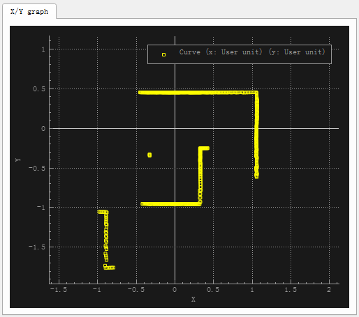
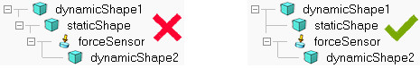

# Vrep

| scenes | https://github.com/CoppeliaRobotics/scenes |
| ------ | ------------------------------------------ |
|        |                                            |
|        |                                            |
|        |                                            |


# 0.安装

下载并解压

`http://www.v-rep.eu/files/V-REP_PRO_EDU_V3_6_2_Ubuntu16_04.tar.xz`

在解压所得文件夹内

`./vrep.sh`

运行程序

# 1.初识Vrep

Vrep的界面除了菜单栏之外全是按钮，请随意点……


vrep界面

拖动中间的灰白相接的格子地面floor，最常用三种操作：

1. 按住鼠标左键进行拖动——平移
2. 鼠标滚轮滚动——缩放
3. 鼠标中键——旋转

左边大家会看到各种机械臂，这在Vrep中叫做**Model**，model相当于封装好的一个模块，将model加入到右边的环境里，只需要用鼠标左键按住——拖动至仿真环境中，在弹出的对话框总选择OK，点击开始按钮，就可以看到仿真模型运动起来了，是不是很简单？

仿真环境中有了模型之后请看Scene hierarchy，我喜欢叫它模型树。模型树里会多出一个模型，就是你刚才拖进去的机械臂，点开这个模型左边的加号，展开这个模型，可以看到一个机械臂是怎么组成的，是不是又不那么简单呢？

接下来请注意左上角的Model browser（模型浏览器），选择robots/mobile文件夹，在下面可视化的界面中可以看到很多好玩的模型，随便拖几个进去玩，感受一下动力学仿真的乐趣。

------

玩的差不多了吧，如果你好好玩了的话，你会发现有些模型会受到重力作用掉下去，而有的模型却飘在空中自由自在不受重力影响，记下这个问题，后面有趣的事情会更多。（*记：为什么有的具有重力属性，有的没有？*）

现在请尝试使用暂停、停止按钮，并尝试使用停止按钮右边的乌龟和兔子按钮，如果现象不是很明显的话就一直点直到变灰，是不是发现仿真的速度变慢/快了。

接下来点右边的多窗口按钮（page selector），选择一个合适的视图组合。

# 2.Vrep小车建模——前进和转向

## Step1模型准备

说明：这个模型可以从零开始建立，也可以根据我给大家提供的起始文件，起始文件我放在淘宝上了，大家可以购买得到，收费的目的是为了让大家更加珍视这次Vrep的学习过程，希望大家不要半途而废，也是我坚持完成系列教程的动力所在。[宝贝链接](https://item.taobao.com/item.htm?spm=a1z38n.10677092.0.0.57f05854oSUPrX&id=563797690100)


起始文件


## Step2构建驱动轮

这里搭建的小车为大家熟知的**万向轮小车**，通过小车后面两个轮子的速度匹配实现前进、转向、后退等运动，是最常见的小车运动形式之一。现在我们先构建一个主动驱动轮。
主动驱动轮的构建思路如下：

1. 建立一个扁平状的圆柱体，作为驱动轮的实体
2. 调整驱动轮的位置和方向，满足滚动的要求
3. 设置实体轮子的动力学参数
4. 将实体轮与贴纸轮组合，完成一个驱动轮构建
5. 通过复制操作，完成两个驱动轮的摆放

### 2.1添加实体

向环境中添加一个圆柱体，从菜单栏依次选择`[Menu bar --> Add --> Primitive shape --> Sphere]`，参数按照下图1进行配置，仅需要修改红框中的内容，得到图2中的结果。


图1 添加圆柱体对话框


图2 添加轮子实体后

2.2调整位置和方向

默认添加轮子的方向不符合滚动要求，需要将其竖直起来。首先在模型树选中刚加入的圆柱体Cylinder，点击旋转按钮，根据图3完成操作。


图3 旋转实体轮


调整轮子的位置，将相对于world坐标系的Z方向位置为0.1175（=0.235/2），设置过程见图4.


图4 设置轮子的空间位置

### 2.3设置实体轮子的动力学参数

关闭平移和旋转的对话框，双击模型树中，模型前面的图标，见图5，打开模型属性窗口。按照图6完成模型的质量属性和转动惯量属性修改。完成此项工作之后，可以尝试运行一下仿真，看看实体轮是否会运动。


图5 双击显示模型属性对话框


图6 模型质量属性和转动惯量属性设置

### 2.4与贴纸轮结合，完成一个主动驱动轮的设计

由于添加的实体圆柱轮看起来实在太丑，因此我为大家提供了一个贴纸轮，为什么叫做贴纸轮呢？是因为这个轮子只提供一个外观，并不参与到动力学计算中，就好像我在上面贴了一层图案。贴纸轮的获取方式请点击[宝贝链接](https://item.taobao.com/item.htm?spm=a1z38n.10677092.0.0.57f05854oSUPrX&id=563797690100)。


好看的贴纸轮^-^


将贴纸轮位置设置与实体轮重合，我们这里采用一种更为便捷的方式，也是后面涉及到**Vrep装配最常用的手段之一**，请大家注意。
首先先用鼠标点选贴纸轮，然后摁住Ctrl键，选择实体轮，点击移动按钮，在平移对话框里选择`Apply to selection`，完成移动，具体过程见图7。移动后的效果见图8。

> 这里需要强调一下**点击的顺序，先选择的是希望移动的部分，最后选择的是目标位置**。这里希望将贴纸轮移动到实体轮这里，所以首先点击贴纸轮，然后点击实体轮。


图7 将贴纸轮移动到实体轮的位置


图8 移动后的效果

### 2.5通过复制操作，完成两个驱动轮的摆放

这里我们在学习两个操作，第一个是**复制**操作，第二个是**调整模型树中的层次关系**。
用Ctrl按键同时选择实体轮和贴纸轮，利用快捷键`Ctrl + c`,`Ctrl + v`完成复制粘贴。
选择模型树中的`LeftWheel_visual`，用快捷键`del`将其删除（由于我们刚才已经复制产生了新的贴纸轮，就不需要原来的贴纸轮了）。
现在修改模型树中的模型名称，双击模型树的模型名称进入编辑状态，见下图，将`Cylinder`修改为`RightWheel`，将`Cylinder0`修改为`LeftWheel`，将`RightWheel_visual0`改为`LeftWheel_visual`


编辑模型名称


修改模型名称


现在调整模型树的层次结构，在模型树窗口中，鼠标拖动至上，拖动至上，完成后的效果如下：


模型树调整之后


> Vrep简单易用主要体现在模型树的操作十分灵活，装配非常方便，灵活应用平移旋转工具调整好相对位置之后就可以用模型树固定下相对关系，对于组装复杂的模型非常便捷，大家后面会慢慢体会到。

完成上面的工作之后，将两个轮子按照XOZ平面对称放置，左驱动轮的设置如图9，右轮类似，将Y方向坐标设置为`-0.25`即可。


图9 左驱动轮的设置


最后的样子为下图：


步骤2完成图


## 3添加车身和万向轮

### 3.1添加车身

车身采用一个长方体即可，在`[Menu bar --> Add --> Primitive shape --> Cuboid]`，设置参数如下图：


添加车身


将车身名称改为,点开平移对话框，设置其位置如下图：


更改车身位置


将移动到上，操作参考，完成后效果如下(由于车身贴纸比车身小一点，所以看不到了):


车身贴纸与车身重合


将车身贴纸移动到车身下一层，修改车身动力学属性，如下图。至此已完成车身的构建，可以尝试运行一下仿真，看看效果。


车身动力学属性调整

### 3.2构建万向轮

真实的模拟万向轮相对麻烦一点，这里为了第一个教程的简便，我们采用一种**投机取巧**的办法，我们把万向轮抽象为一个与地面没有摩擦力的实体，即实现了万向轮的功能。

> 这种“投机取巧”的行为在后面的动力学仿真中会经常用到，通过合理的抽象，将一些次要功能简单化的实现，从而将注意力集中到核心问题上，达到自己的研究目的。这是我们用到的第一个投机取巧的功能，后续我会不断介绍一些小技巧，让大家能够更快更好的完成仿真。

**鉴于大家已经认真完成上面的操作走到这里，下面我将不再细致的讲解已经说明的操作。**
通过菜单栏添加一个球体（Sphere），设置球体直径为0.15，修改其名称为`Universal_wheel`，调整其空间位置如下图。将贴纸轮与球体重合，并修改层次关系。最后设置一下球体的动力学属性以，完成万向轮的构建。


万向轮设置


最后别忘了一点，我们需要设置万向轮与地面，选择。


万向轮材料属性设置


完成上述内容后可以尝试运行一下仿真，发现车体迅速分解，下一节我们就添加约束关系。

## 4添加各部件约束，完成车体模型树构建

### 4.1将万向轮与车身固定

在Vrep中有两种方式可以将两个具有动力学属性的物体固定

1. 采用力传感器（Force sensor）将两个物体进行连接，实现固连
2. 采用`Group`或`Merge`将两个物体进行组合

我们这里先采用第一种方式，`[Menu bar --> Add --> Force sensor]`，移动其位置，并按照下图设置模型层次。运行仿真，可以看到万向轮与车身不会分开。


力传感器添加


4.2添加驱动关节
驱动关节可以模拟机器人的驱动电机，能够实现速度控制、位置控制和力控制等。我们这里准备采用速度控制。

采用菜单栏命令`[Menu bar --> Add --> Joint --> Revolute ]`，得到下图。将关节名字重命名为`RightMotor`。


image.png


这里我们还是采用2.4节的位置调整方式，不过这次我们不仅要调整关节的位置，还需要调整关节的方向。调整关节位置依然是首先选择关节，然后选择右轮，然后选择位置选项卡，完成平移。


调整驱动关节位置


旋转操作类似，依次执行下图的操作，完成方向设置。


调整驱动关节方向

重复上面的操作，完成左轮的驱动关节添加，最后调整关节的模型层次树，最后结果见下图。运行仿真，发现车体没有解体，证明我们的车身结构已经搭建完成。


关节添加完成图

> 如果在完成车身结构搭建后，运行仿真发现车身会运动，可以选择不同的求解器，看看不同求解器的差别，下面将解决无缘无故车体运动的问题。
>
> 
>
> 
>
> 尝试不同的求解器试试

## 5完成全部工作

### 5.1设置可见和不可见属性

现在模型和帖子混在一起，既看起来丑，也没有发挥贴纸的作用，下面将简单的实体隐藏。
选择`Car_body`，打开属性对话框，按照下图设置，将其隐藏。


image.png


同理，对于非贴纸类型的，都隐藏，得到下图，是不是好看多了？


调整隐藏关系后


感觉车身位置略高，我们需要重新调整一下贴纸的位置，


修正车身高度

### 5.2设置关节驱动参数

关节需要打开Motor enable，使得关节能够输出扭矩，提供动力，将左右两个关节均按照下图设置，设置完成后尝试运行一下仿真。
关节驱动设置
可以看到模型可以运动，试着给两个电机不同的速度信号，实现转向。

细心的同学可能会发现给关节电机是正方向的指令，但是小车却是向后运动。这个没有关系，只要我们在给电机输入指令是注意一下即可。强迫症的同学请尝试旋转关节，将其正方向与小车前进方向对应，这里不再赘述。

# 3.Vrep小车建模——内嵌脚本

## Step0基础知识

Vrep最强大的功能之一就是能够通过各种脚本来控制，想必大家在学习vrep的时候已经具备一点基本的编程能力，更多的同学可能已经掌握了Matlab或者是python。本来我原计划是想先用matlab控制小车，想来想去还是决定用Vrep自带的lua来控制，因为这种偏底层的驱动控制我觉得用lua实现最好了，复杂的上层控制再交给matlab，这样就不用涉及到同步模式（synchronous operation mode，这种模式仿真速度会大大降低，软件的通信占据了太多的时间）。
大家可能会疑惑怎么又要学一门语言，而且可能都没有听过lua，没关系的，非常简单。而且既然大家要研究机器人仿真，学习一门语言来极大的加速你的学习过程，这个我想是非常值得的。做机器人，大家就要有这个心理准备，机械、电子、编程啥都不会点，还怎么搞机器人，是吧？
废话少说，下面的安排是：

1. 用脚本驱动小车运动
2. 用GUI驱动控制小车运动参数（**重要**）
3. 显示数据曲线

## Step1用脚本控制小车运动

Vrep的脚本类型非常多，最常用的就4种，non-thread child script，threaded child script，joint control callback scripts和customization scripts。各种脚本之间使用非常类似，今天就先讲non-thread child script。
Non-thread child script，从名字上也能看出来，这个脚本是单线程的，不能并行执行。记得有位知友在知乎上曾经说过Vrep有个问题就是脚本执行的顺序是未知的，其实这个问题可以通过两个方式来避免，第一个就是设置不同脚本的优先级，另一个就是一般复杂度的问题并不会遇到，所以大家刚开始时候不要过于担心。
废话说的有点多，只是希望大家不要有惧怕心理，开始吧。
这一节依然使用上一节的做好的小车，第一个功能是我们添加一个脚本，让小车能够按照不同的速度运动。


图1 起始的环境


按照图2添加一个Non-thread child script，将其绑定在Car_body实体上，见图3。**注：添加完child 脚本后不能直接绑定实体，需要先切换到另一个脚本上（如Main script），然后再切换回来，才可以绑定。**


图2 添加脚本


图3 绑定Car_body后在实体后出现脚本的标志


添加脚本后，我们双击Car_body后的脚本图标，打开脚本编辑器：


图4 打开脚本编辑器

到这里我们可以先看一下脚本的大结构:

```lua
function sysCall_init()
    --完成初始化工作
end

function sysCall_actuation()
    --做执行动作，比如控制关节运动，位置移动等
end

function sysCall_sensing()
    -- 执行感知操作，比如读取距离传感器数据，读取关节力矩等
end

function sysCall_cleanup()
    --执行清理工作，比如要清楚掉建立的GUI窗口什么的
end
```

看了这个结构大家就很清楚了嘛，如果有点工程经验就会更清楚了。

- 初始化（Initialization）：初始化这个语句只执行一次，也是在仿真开始的时候执行，主要完成变量初始值的初始化，获取你需要的实体的handle（句柄，或者理解成指向仿真环境中的某个部件的指针，随意理解，接受为主）
- 执行（Actuation）：“执行”相当于在提交到动力学引擎计算之前进行的操作，比如你这里设置了关节的转速，然后动力学引擎就驱动这个关节按照这个转速运动，直到下次再执行到此部分。
- 感知（Sensing）：控制里最重要的一块内容，也是我认为控制系统设计的核心。一切控制算法都是基于反馈来做的，大家做机器人控制一定要注意有些值很难测量或者误差特别大（电机电流，受摩擦影响大），有些值可以精准测量并且误差小（关节角度）。这一部分的执行顺序是位于Actuation之后
- 清理（cleanup）：清理是个好习惯，尤其是后面会给大家介绍使用QT_based GUI的时候，一定要在程序仿真结束后清理。

现在就让我们编写第一个控制小车控制程序吧。将下面的程序覆盖到Car_body脚本中，试一下仿真效果。

```lua
function sysCall_init()
    MotorHandle_Left=simGetObjectHandle('LeftMotor')
    MotorHandle_Right=simGetObjectHandle('RightMotor')
    
    Left_vel = -1
    Right_vel = -3 
end

function sysCall_actuation()
    -- put your actuation code here
    --
    -- For example:
    --
    -- local position=sim.getObjectPosition(handle,-1)
    -- position[1]=position[1]+0.001
    -- sim.setObjectPosition(handle,-1,position)
    simSetJointTargetVelocity(MotorHandle_Left,Left_vel)
    simSetJointTargetVelocity(MotorHandle_Right,Right_vel)
end

function sysCall_sensing()
    -- put your sensing code here
end

function sysCall_cleanup()
    -- do some clean-up here
end
```

添加一个辅助工具，就是`Graph`，使用此工具显示小车运动的轨迹。在Add菜单里选择Graph，打开属性对话框（后面打开属性对话框这些简单操作就不一一截图了），分别添加`Car_body`的x、y、z坐标，修改名字为`Car_body_X`等，操作见图5.

图5 添加Graph


添加完坐标之后，即可添加3D曲线，按照图6的方式添加，可以更改Curve width改变线宽。关闭Graph的属性窗口，运行仿真，得到图7的结果。


图6 添加3D曲线


图7 3D Curve效果


> 3D Curve是非常有用的，比如你要观察机械臂的末端的运动轨迹的时候，就可以利用此方式添加一条轨迹。

采用脚本编程一定要学会**读文档**，按照下面两张图，找到`simSetJointTargetVelocity`这个函数的说明，注意他的输入值和返回值。

http://www.v-rep.eu/helpFiles/index.html


打开vrep的帮助文档


查看函数手册

## Step2利用GUI驱动控制小车运动参数

上面介绍了一种用初始化转速的方式控制小车的运动，如果将你的控制代码嵌入到控制程序中即可使用。但是另一种使用场景为我们希望采用界面操作的方式手动输入一些参数，或者是采用一些滑块等方式调整仿真状态，这就涉及到了采用GUI实现的方式。
Vrep中在3.3.2版本中支持两种GUI的构建，一种是基于OenGl-based custom UIs，另一种是基于Qt-based custom UIs。OpenGl这种方式刚开始使用的时候比较方便，但是灵活性太差，**OpenGl在3.4版本中已经废弃了**。Qt的构建方式虽然入门稍微稍微难一点，但是还是使用一段时间后就会发现非常好用，而且修改起来很方便，所以这里就直接给大家介绍基于Qt的构建方式。
Qt构建方式是基于xml的方式构建的，就是利用一种约定俗成的方式描述各个控件，如果你有做网页等相关的基础，做这个就还是很easy啦。具体的语法我就不一一讲解了，这种标记语言你就接受就可以了，有什么不清楚的地方大家还是自己查一下xml的格式。
将下面的代码复制到Car_body的脚本中，仿真查看仿真效果见图8。

```lua
xml = [[
<ui closeable="true" onclose="closeEventHandler" resizable="true">
    <label text="Car control pan" wordwrap="true" />
    <group>
        <label text="Right wheel speed:"  wordwrap="true" />
        <spinbox minimum="-30" maximum="30" onchange = "Right_speed_set" />
        <label text="Left wheel speed:0" wordwrap="true" />
        <spinbox minimum="-30" maximum="30" onchange = "Left_speed_set" />
        <stretch />
    </group>
    
    <group>
        <button text="Start move" onclick = "Start_move" />
        <button text="Stop move" onclick = "Stop_move" />
        <stretch />
    </group>
    
</ui>
]]

function Start_move(h)
    Start_flag = true
    
end
function Stop_move(h)
    Start_flag = false
    
end
function Right_speed_set(ui,id,newVal)
    Right_vel = newVal
end
function Left_speed_set(ui,id,newVal)
    Left_vel = newVal
end

function closeEventHandler(h)
    simAddStatusbarMessage('Window '..h..' is closing...')
    simExtCustomUI_hide(h)
end

function sysCall_init()
    MotorHandle_Left=simGetObjectHandle('LeftMotor')
    MotorHandle_Right=simGetObjectHandle('RightMotor')
    
    ui=simExtCustomUI_create(xml)
    Left_vel = 0
    Right_vel = 0 
    Start_flag = false
end

function sysCall_actuation()
    if Start_flag then
        simSetJointTargetVelocity(MotorHandle_Left,Left_vel)
        simSetJointTargetVelocity(MotorHandle_Right,Right_vel)
    else
        simSetJointTargetVelocity(MotorHandle_Left,0)
        simSetJointTargetVelocity(MotorHandle_Right,0)
    end
end

function sysCall_sensing()
    -- put your sensing code here
end

function sysCall_cleanup()
    simExtCustomUI_destroy(ui)
end
```


图8 简版小车控制GUI

**除此之外我还提供了一个功能比较完备的控制台，具备参数更新等功能，也增加了一些控件支持，足够大部分功能的应用需求，后续仅需要修改部分代码就可以移植，购买请点击本节教程链接。**（由于Vrep中不支持中文，因此代码中文注释版也放在教程链接中了，上面给出的代码为可执行代码，并没有注释）

## Step3显示数据曲线

在实际仿真过程中，我们往往需要查看一些运动数据，采用图表的形式展示出来。刚才我们采用Graph，用于绘制车体运动的轨迹曲线，接下来，我们同样采用Graph，用于绘制运动过程中驱动关节的实际速度。
使用菜单栏Add添加Graph，按照图9的方式分别添加两轮的速度数据流(Data stream)，修改数据流的名称为`Left_speed`和`Right_speed`，如图10所示。


图9 添加关节运动速度的数据流


图10

关闭Graph属性窗口，我们这里建立一个窗口用于显示曲线。我们采用floating view的手段（在3.4版本中会自动建立一个图表窗口，3.3版本没有）。在仿真的page任意点击鼠标右键，按照图11的方式添加，一个空白的floating view窗口。


图11 添加floating View

添加一个空白的窗口后需要将此窗口和刚才添加的Graph0进行链接，按照图12进行操作（注意第二部为在floating view处右击）。链接好了之后可以进行仿真，就可以看到图线了。（由于默认的曲线颜色均是红色，不便于区分，可以在Graph中进行设置，可以在图13中设置曲线颜色）


图12 链接Graph0和floating view窗口


图13设置曲线颜色

## 结语

采用lua实现一些功能绝对是你之后进行机器人仿真的一大利器，我在第二篇的连载教程里就讲完，是因为后面很多功能需要用到，所以希望大家一定要将本文的例程研究透彻，当然最好购买完整的[代码](https://item.taobao.com/item.htm?spm=a1z38n.10677092.0.0.5c83ab30OWqu23&id=564107062247)，尽快的掌握Vrep的使用。

# 4.Vrep小车建模——matlab控制

# 本节介绍

# Step1 准备工作

matlab和vrep连接需要一些基本文件。首先要注意你的系统是**32位**的还是**64位**的，还有你安装的vrep的版本。
如果你安装的是**3.4.0版本**，那么你的vrep是装在`C:\Program Files\V-REP3`这个目录下，如果你的是**3.3.2版本**，那么你的vrep是装在`C:\Program Files (x86)\V-REP3`这个目录下，下面以3.3.2版本为例，如果你用3.4版本的话就直接替换前面的路径即可。
先新建一个matlab的工作路径，比如我这里建立一个`E:\monkey\Vrep Tutorial\3vrep_car_Matlab`的路径。打开`C:\Program Files (x86)\V-REP3\V-REP_PRO_EDU\programming\remoteApiBindings\lib\lib`，根据你的系统选择合适的文件夹，将下面的`remoteApi.dll`文件拷贝到你的matlab工作路径中；然后打开`C:\Program Files (x86)\V-REP3\V-REP_PRO_EDU\programming\remoteApiBindings\matlab\matlab`,将此文件夹下的所有文件都拷贝到你的工作路径下。看文字太麻烦的请看下面的动图，是不是要高喊666！！（感谢GifCam这款软件，太棒了！）


拷贝所需要的文件


# Step1 Matlab控制小车运动和停止

前两节教程我们制作了一个双轮驱动的小车，有同学和我反应说是万向轮有点丑，用球体来抽象实在是太难看了，并且修改了一些小bug（比如轮子速度与直观感觉相反），这里我修改了一下，看下图。是不是看起来自然了一点？


万向轮修改后


万向轮处理完了之后，我们在车轮中间添加一个标志点，名称为dummy。这个dummy的功能非常多，可以单独使用，也可以成对使用，下面就简单列举几种功能：

- 单独使用

1. 用于做坐标系转换的中间参考，比如机械臂的安装位置和小车的转动中心有一定的偏差，可以中间加一个参考坐标dummy
2. 做一些显示，比如显示机械臂末端的位置
3. 做为一些非dynamic的的父节点。比如环境中的floor的父节点就是dummy。

- 成对使用

1. 用于逆运动学解算，IK
2. 动力学约束。比如你要让连杆结构的两个点始终固连到一起（这种情况一般常见于**闭运动链**）
3. 当你搞不清坐标转换关系时，用一堆dummy去求相对位置和角度

大家刚开始用，要慢慢体会dummy的妙处，我这里先抛砖引玉。这里我们要在两个车轮的中心位置添加一个dummy，作为车辆的回转中心，同时添加一个目标位置，一会我们通过移动目标位置（黄色区域），控制小车能够准确驶入目标区域。我们使用这个状态作为起始状态，文件名为`Vrep3_car_code_Step1.ttt`，获取文件请[点击购买](https://item.taobao.com/item.htm?spm=0.7095261.0.0.2eb4cc2dOQp9u5&id=564553923700)。

<<<<<<< HEAD


# 关节控制

http://www.coppeliarobotics.com/helpFiles/en/jointDescription.htm

There are many different ways a joint can be controlled. In following section, we differentiate betwen a ***loose*** controller and a ***precise*** controller: a ***loose*** joint controller will not be able to provide new control values in each possible regulation step (e.g. some regulation steps might/will be skipped, but control is still possible). A ***precise*** joint controller on the other hand, will be able to provide control values in each possible regulation step.

First, the approach to take for controlling a joint will depend on the joint mode:

[The joint is not in force/torque mode](http://www.coppeliarobotics.com/helpFiles/en/jointDescription.htm#nonForceTorqueMode).

[The joint operates in force/torque mode](http://www.coppeliarobotics.com/helpFiles/en/jointDescription.htm#forceTorqueMode).

The differentiation comes from the fact that a joint that operates in force/torque mode will be handled by the physics engine. And the physics engine will perform by default 10 times more calculation steps than the simulation loop: the simulation loop runs at 20Hz (in simulation time), while the physics engine runs at 200Hz (also in simulation time). That default behaviour can entirely be configured if required.

**If the joint is not in force/torque mode**: if the joint is not in force/torque mode, then you can directly (and instantaneously) set its position via the [sim.setJointPosition](http://www.coppeliarobotics.com/helpFiles/en/regularApi/simSetJointPosition.htm) API function (or similar, e.g. [simxSetJointPosition](http://www.coppeliarobotics.com/helpFiles/en/b0RemoteApi-cpp.htm#simxSetJointPosition) for the B0-based remote API, or [simxSetJointPosition](http://www.coppeliarobotics.com/helpFiles/en/remoteApiFunctions.htm#simxSetJointPosition) for the legacy remote API). You can do this from a [child script](http://www.coppeliarobotics.com/helpFiles/en/childScripts.htm), from a [plugin](http://www.coppeliarobotics.com/helpFiles/en/plugins.htm), from a [ROS](http://www.coppeliarobotics.com/helpFiles/en/rosInterfaces.htm) node, from a [BlueZero](http://www.coppeliarobotics.com/helpFiles/en/blueZeroPlugin.htm) node, or from a [remote API](http://www.coppeliarobotics.com/helpFiles/en/remoteApiOverview.htm) client. If you do this from a child script, then it should be done inside of the *actuation section* of the [non-threaded child script](http://www.coppeliarobotics.com/helpFiles/en/childScripts.htm#nonThreaded), or from a [threaded child script](http://www.coppeliarobotics.com/helpFiles/en/childScripts.htm#threaded) that executes before the *sensing phase* of the [main script](http://www.coppeliarobotics.com/helpFiles/en/mainScript.htm) (default). In the latter case however, make sure to have your threaded child script synchronized with the simulation loop for ***precise*** control.

In following [threaded child script](http://www.coppeliarobotics.com/helpFiles/en/childScripts.htm#threaded) example, the joint is controlled ***loosely*** in position, and there is no synchronization with the simulation loop:

```
-- Following script should run threaded:

jointHandle=sim.getObjectHandle('Revolute_joint')

sim.setJointPosition(jointHandle,90*math.pi/180) -- set the position to 90 degrees
sim.wait(2) -- wait 2 seconds (in simulation time)
sim.setJointPosition(jointHandle,180*math.pi/180) -- set the position to 180 degrees
sim.wait(1) -- wait 1 second (in simulation time)
sim.setJointPosition(jointHandle,0*math.pi/180) -- set the position to 0 degrees
etc.
```

In following [threaded child script](http://www.coppeliarobotics.com/helpFiles/en/childScripts.htm#threaded) example, the joint is controlled **precisely** in position in each simulation step, i.e. the thread is synchronized with the simulation loop:

```
-- Following script should run threaded:

sim.setThreadSwitchTiming(200) -- Automatic thread switching to a large value (200ms)
jointHandle=sim.getObjectHandle('Revolute_joint')

sim.setJointPosition(jointHandle,90*math.pi/180) -- set the position to 90 degrees
sim.switchThread() -- the thread resumes in next simulation step (i.e. when t becomes t+dt)
sim.setJointPosition(jointHandle,180*math.pi/180) -- set the position to 180 degrees
sim.switchThread() -- the thread resumes in next simulation step
sim.setJointPosition(jointHandle,0*math.pi/180) -- set the position to 0 degrees
sim.switchThread() -- the thread resumes in next simulation step
-- etc.

-- In above code, a new joint position is applied in each simulation step
```

When you try to control a joint that is not in force/torque mode from an external application (e.g. via the [remote API](http://www.coppeliarobotics.com/helpFiles/en/remoteApiOverview.htm), [ROS](http://www.coppeliarobotics.com/helpFiles/en/rosInterfaces.htm) or [BlueZero](http://www.coppeliarobotics.com/helpFiles/en/blueZeroPlugin.htm)), then the external controller will run asynchronously to V-REP (i.e. similar to the non-synchronized code of a [threaded child script](http://www.coppeliarobotics.com/helpFiles/en/childScripts.htm#threaded)). This is fine most of the time for **loose** control, but if you wish to control the position of the joint **precisely** in each simulation loop, you will have to run V-REP in synchronous mode, and the external controller (e.g. the remote API client) will have to trigger each simulation step explicitely.

# 摄像头

float view->view->add associated camera


# 5.Lua

类matlab

# 6.Ros

| **vrep_ros_bridge**                                          | https://github.com/lagadic/vrep_ros_bridge#installation-plugin |
| ------------------------------------------------------------ | ------------------------------------------------------------ |
| [Lua Table 操作](https://www.cnblogs.com/plateFace/p/4762218.html) | https://www.cnblogs.com/plateFace/p/4762218.html             |
|                                                              |                                                              |
|                                                              |                                                              |

# RosInterface

下面看一个简单的例子。在场景中选择一个物体添加一个non-threaded脚本，这个脚本会发布仿真时间然后自己订阅它，并且还会发布坐标变换消息：

```
function subscriber_callback(msg)
    -- This is the subscriber callback function
    simAddStatusbarMessage('subscriber receiver following Float32: '..msg.data)
end

function getTransformStamped(objHandle,name,relTo,relToName)
    -- This function retrieves the stamped transform for a specific object
    t=simGetSystemTime()
    p=simGetObjectPosition(objHandle,relTo)
    o=simGetObjectQuaternion(objHandle,relTo)
    return {
        header={
            stamp=t,
            frame_id=relToName
        },
        child_frame_id=name,
        transform={
            translation={x=p[1],y=p[2],z=p[3]},
            rotation={x=o[1],y=o[2],z=o[3],w=o[4]}
        }
    }
end

if (sim_call_type==sim_childscriptcall_initialization) then
    -- The child script initialization
    objectHandle=simGetObjectAssociatedWithScript(sim_handle_self)
    objectName=simGetObjectName(objectHandle)
    -- Check if the required RosInterface is there:
    moduleName=0
    index=0
    rosInterfacePresent=false
    while moduleName do
        moduleName=simGetModuleName(index)
        if (moduleName=='RosInterface') then
            rosInterfacePresent=true
        end
        index=index+1
    end

    -- Prepare the float32 publisher and subscriber (we subscribe to the topic we advertise):
    if rosInterfacePresent then
        publisher=simExtRosInterface_advertise('/simulationTime','std_msgs/Float32')
        subscriber=simExtRosInterface_subscribe('/simulationTime','std_msgs/Float32','subscriber_callback')
    end
end

if (sim_call_type==sim_childscriptcall_actuation) then
    -- Send an updated simulation time message, and send the transform of the object attached to this script:
    if rosInterfacePresent then
        simExtRosInterface_publish(publisher,{data=simGetSimulationTime()})
        simExtRosInterface_sendTransform(getTransformStamped(objectHandle,objectName,-1,'world'))
        -- To send several transforms at once, use simExtRosInterface_sendTransforms instead
    end
end

if (sim_call_type==sim_childscriptcall_cleanup) then
    -- Following not really needed in a simulation script (i.e. automatically shut down at simulation end):
    if rosInterfacePresent then
        simExtRosInterface_shutdownPublisher(publisher)
        simExtRosInterface_shutdownSubscriber(subscriber)
    end
end
```


　　终端中输入rostopic list指令查看话题：


　　为了查看消息的内容，可以输入：

```
$ rostopic echo /simulationTime
```


脚本中主要用到下面几个函数：

- simExtRosInterface_advertise


```lua
publisher=simExtRosInterface_advertise('/simulationTime','std_msgs/Float32')
```

- simExtRosInterface_subscribe


```lua
subscriber=simExtRosInterface_subscribe('/simulationTime','std_msgs/Float32','subscriber_callback')
```

- simExtRosInterface_publish


```lua
simExtRosInterface_publish(publisher,{data=simGetSimulationTime()})
```

将table类型的数据写入publisher里并发布出去，table类型见[Lua Table 操作](https://www.cnblogs.com/plateFace/p/4762218.html)

- simExtRosInterface_sendTransform

 

```lua
simExtRosInterface_sendTransform(getTransformStamped(objectHandle,objectName,-1,'world'))
```

**rosInterfaceTopicPublisherAndSubscriber**

　　在V-rep自带的例子中还有一个场景模型"rosInterfaceTopicPublisherAndSubscriber.ttt"，脚本代码中会发布视觉传感器捕获的图像信息到/image话题上，同时会自己订阅这个信息并显示出来。


```lua
-- This illustrates how to publish and subscribe to an image using the ROS Interface.
-- An alternate version using image transport can be created with following functions:
--
-- simExtRosInterface_imageTransportAdvertise
-- simExtRosInterface_imageTransportPublish
-- simExtRosInterface_imageTransportShutdownPublisher
-- simExtRosInterface_imageTransportShutdownSubscriber
-- simExtRosInterface_imageTransportSubscribe

function imageMessage_callback(msg)
    -- Apply the received image to the passive vision sensor that acts as an image container
    simSetVisionSensorCharImage(passiveVisionSensor,msg.data)
end

if (sim_call_type==sim_childscriptcall_initialization) then
    -- Get some handles:
    activeVisionSensor=simGetObjectHandle('Vision_sensor')
    passiveVisionSensor=simGetObjectHandle('PassiveVision_sensor')

    -- Enable an image publisher and subscriber:
    pub=simExtRosInterface_advertise('/image', 'sensor_msgs/Image')
    --定义了发布image的图像Topic的句柄handle
    --After calling this function, this publisher will treat uint8 arrays as string. Using strings should be in general much faster that using int arrays in Lua.
    simExtRosInterface_publisherTreatUInt8ArrayAsString(pub) -- treat uint8 arrays as strings (much faster, tables/arrays are kind of slow in Lua)
    --设置句柄接收和输出数据类型，以实现强行将uin8数组转成string并发布出去，这个函数不是发布函数，是句柄的设置函数

    sub=simExtRosInterface_subscribe('/image', 'sensor_msgs/Image', 'imageMessage_callback')
    --定义句柄，订阅/image的节点，并运行回调函数
    simExtRosInterface_subscriberTreatUInt8ArrayAsString(sub) -- treat uint8 arrays as strings (much faster, tables/arrays are kind of slow in Lua)
    --设置句柄，强转订阅
end

if (sim_call_type==sim_childscriptcall_sensing) then
    -- Publish the image of the active vision sensor:
    local data,w,h=simGetVisionSensorCharImage(activeVisionSensor)
    --下面时table类型的初始化赋值图像信息
    d={}
    d['header']={seq=0,stamp=simExtRosInterface_getTime(), frame_id="a"}
    d['height']=h
    d['width']=w
    d['encoding']='rgb8'
    --bigendian大端；正序
    d['is_bigendian']=1
    d['step']=w*3
    d['data']=data
    simExtRosInterface_publish(pub,d)
end

if (sim_call_type==sim_childscriptcall_cleanup) then
    -- Shut down publisher and subscriber. Not really needed from a simulation script (automatic shutdown)
    simExtRosInterface_shutdownPublisher(pub)
    simExtRosInterface_shutdownSubscriber(sub)
end
```

　　可以在终端中输入下面的命令来显示/image话题的图像：

```
$ rosrun image_view image_view image:=/image
```


 　　在rviz中添加Image，将话题选为/image也可以查看图像信息：


**controlTypeExamples**

 　　还有一个例子是controlTypeExamples.ttt，V-rep中的脚本负责发布接近传感器的信息以及仿真时间并订阅左右轮驱动的话题。外部的ros程序rosBubbleRob2根据接收到的传感器信息生成左右轮速度指令，并发布出去，V-rep中订阅后在回调函数里控制左右轮关节转动。


　　V-rep中脚本代码如下：

```lua
function setLeftMotorVelocity_cb(msg)

    -- Left motor speed subscriber callback

    simSetJointTargetVelocity(leftMotor,msg.data)

end


function setRightMotorVelocity_cb(msg)

    -- Right motor speed subscriber callback

    simSetJointTargetVelocity(rightMotor,msg.data)

end


function getTransformStamped(objHandle,name,relTo,relToName)

    t=simGetSystemTime()

    p=simGetObjectPosition(objHandle,relTo)
--objectHandle: handle of the object物体的句柄
--relativeToObjectHandle: indicates relative to which reference frame we want the position. Specify -1 to retrieve the absolute position, sim_handle_parent to retrieve the position relative to the object's parent, or an object handle relative to whose reference frame we want the position.  当为-1时返回绝对位置，为sim_handle_parent时返回相对于父坐标系下的位置，即相对位置
    o=simGetObjectQuaternion(objHandle,relTo)
--返回table类型
    return {

        header={

            stamp=t,
--设置frame_id
            frame_id=relToName

        },

        child_frame_id=name,

        transform={

            translation={x=p[1],y=p[2],z=p[3]},

            rotation={x=o[1],y=o[2],z=o[3],w=o[4]}

        }

    }

end


if (sim_call_type==sim_childscriptcall_initialization) then

    robotHandle=simGetObjectAssociatedWithScript(sim_handle_self)

    leftMotor=simGetObjectHandle("rosInterfaceControlledBubbleRobLeftMotor") -- Handle of the left motor

    rightMotor=simGetObjectHandle("rosInterfaceControlledBubbleRobRightMotor") -- Handle of the right motor

    noseSensor=simGetObjectHandle("rosInterfaceControlledBubbleRobSensingNose") -- Handle of the proximity sensor


    -- Check if the required ROS plugin is there:

    moduleName=0

    moduleVersion=0

    index=0

    pluginNotFound=true

    while moduleName do

        moduleName,moduleVersion=simGetModuleName(index)

        if (moduleName=='RosInterface') then

            pluginNotFound=false

        end

        index=index+1

    end


    -- Add a banner:

    if (pluginNotFound) then

        bannerText="I cannot run! (I couldn't find my RosInterface plugin)"

    else

        bannerText="I am controlled via a ROS node and the RosInterface! ('rosBubbleRob2' controlls me)"

    end

    black={0,0,0,0,0,0,0,0,0,0,0,0}

    red={0,0,0,0,0,0,0,0,0,1,0.2,0.2}

    simAddBanner(bannerText,0,sim_banner_bitmapfo2019-09-21 22-26-03屏幕截图nt+sim_banner_overlay,nil,simGetObjectAssociatedWithScript(sim_handle_self),black,red)


    -- Ok now launch the ROS client application:

    if (not pluginNotFound) then

        local sysTime=simGetSystemTimeInMs(-1) 

        local leftMotorTopicName='leftMotorSpeed'..sysTime -- we add a random component so that we can have several instances of this robot running
        --末尾添加初始化时的时间，实现多台车子同时运行

        local rightMotorTopicName='rightMotorSpeed'..sysTime -- we add a random component so that we can have several instances of this robot running

        local sensorTopicName='sensorTrigger'..sysTime -- we add a random component so that we can have several instances of this robot running

        local simulationTimeTopicName='simTime'..sysTime -- we add a random component so that we can have several instances of this robot running


        -- Prepare the sensor publisher and the motor speed subscribers:

        sensorPub=simExtRosInterface_advertise('/'..sensorTopicName,'std_msgs/Bool')

        simTimePub=simExtRosInterface_advertise('/'..simulationTimeTopicName,'std_msgs/Float32')

        leftMotorSub=simExtRosInterface_subscribe('/'..leftMotorTopicName,'std_msgs/Float32','setLeftMotorVelocity_cb')

        rightMotorSub=simExtRosInterface_subscribe('/2019-09-21 22-26-03屏幕截图'..rightMotorTopicName,'std_msgs/Float32','setRightMotorVelocity_cb')


        -- Now we start the client application:

        result=simLaunchExecutable('rosBubbleRob2',leftMotorTopicName.." "..rightMotorTopicName.." "..sensorTopicName.." "..simulationTimeTopicName,0)

    end2019-09-21 22-26-03屏幕截图

end


if (sim_call_type==sim_childscriptcall_actuation) then

    -- Send an updated sensor and simulation time message, and send the transform of the robot:

    if not pluginNotFound then

        local result=simReadProximitySensor(noseSensor)

        local detectionTrigger={}

        detectionTrigger['data']=result>0

        simExtRosInterface_publish(sensorPub,detectionTrigger)

        simExtRosInterface_publish(simTimePub,{data=simGetSimulationTime()})

        -- Send the robot's transform:

        simExtRosInterface_sendTransform(getTransformStamped(robotHandle,'rosInterfaceControlledBubbleRob',-1,'world'))
            --getTransformStamped(robotHandle,'rosInterfaceControlledBubbleRob',-1,'world')
            --该函数是这个脚本自己定义的函数，详细可以看上
            --获取robotHandle的绝对位置，并将自坐标系设为'rosInterfaceControlledBubbleRob'，-1表示返回绝对位置，'world'为frame_id

        -- To send several transforms at once, use simExtRosInterface_sendTransforms instead

    end

end


if (sim_call_type==sim_childscriptcall_cleanup) then

    if not pluginNotFound then

        -- Following not really needed in a simulation script (i.e. automatically shut down at simulation end):

        simExtRosInterface_shutdownPublisher(sensorPub)

        simExtRosInterface_shutdownSubscriber(leftMotorSub)

        simExtRosInterface_shutdownSubscriber(rightMotorSub)

    end

end
```

### simSetJointPosition / sim.setJointPosition

| Description       | Sets the intrinsic position of a joint. May have no effect depending on the joint mode. This function cannot be used with spherical joints (use [sim.setSphericalJointMatrix](http://www.coppeliarobotics.com/helpFiles/en/regularApi/simSetSphericalJointMatrix.htm) instead). See also [sim.getJointPosition](http://www.coppeliarobotics.com/helpFiles/en/regularApi/simGetJointPosition.htm) and [sim.setJointTargetPosition](http://www.coppeliarobotics.com/helpFiles/en/regularApi/simSetJointTargetPosition.htm). |
| ----------------- | ------------------------------------------------------------ |
| C synopsis        | simInt simSetJointPosition(simInt objectHandle,simFloat position) |
| C parameters      | **objectHandle**: handle of the joint object**position**: position of the joint (angular or linear value depending on the joint type) |
| C return value    | -1 if operation was not successful. In a future release, a more differentiated return value might be available |
| Lua synopsis      | number result=sim.setJointPosition(number objectHandle,number position) |
| Lua parameters    | Same as C-function                                           |
| Lua return values | Same as C-function                                           |
| Remote API equiv. | B0-based remote API: [simxSetJointPosition](http://www.coppeliarobotics.com/helpFiles/en/b0RemoteApi-cpp.htm#simxSetJointPosition)Legacy remote API: [simxSetJointPosition](http://www.coppeliarobotics.com/helpFiles/en/remoteApiFunctions.htm#simxSetJointPosition) |

### simGetObjectPosition / sim.getObjectPosition

| Description       | Retrieves the position of an object. See also [sim.setObjectPosition](http://www.coppeliarobotics.com/helpFiles/en/regularApi/simSetObjectPosition.htm), [sim.getObjectOrientation](http://www.coppeliarobotics.com/helpFiles/en/regularApi/simGetObjectOrientation.htm), [sim.getObjectMatrix](http://www.coppeliarobotics.com/helpFiles/en/regularApi/simGetObjectMatrix.htm) and the other [matrix/transformation fun**ctions](http://www.coppeliarobotics.com/helpFiles/en/apiFunctionListCategory.htm#coordinatesAndTransformations). |
| ----------------- | ------------------------------------------------------------ |
| C synopsis        | simInt simGetObjectPosition(simInt objectHandle,simInt relativeToObjectHandle,simFloat* position) |
| C parameters      | **objectHandle**: handle of the object**relativeToObjectHandle**: indicates relative to which reference frame we want the position. Specify -1 to retrieve the absolute position, sim_handle_parent to retrieve the position relative to the object's parent, or an object handle relative to whose reference frame we want the position. **position**: pointer to 3 values (x, y and z) |
| C return value    | -1 if operation was not successful. In a future release, a more differentiated return value might be available |
| Lua synopsis      | table_3 position=sim.getObjectPosition(number objectHandle,number relativeToObjectHandle) |
| Lua parameters    | Same as C-function                                           |
| Lua return values | **position**: table of 3 values (x, y and z) or nil in case of an error |
| Remote API equiv. | B0-based remote API: [simxGetObjectPosition](http://www.coppeliarobotics.com/helpFiles/en/b0RemoteApi-cpp.htm#simxGetObjectPosition), [simxGetObjectPose](http://www.coppeliarobotics.com/helpFiles/en/b0RemoteApi-cpp.htm#simxGetObjectPose)Legacy remote API: [simxGetObjectPosition](http://www.coppeliarobotics.com/helpFiles/en/remoteApiFunctions.htm#simxGetObjectPosition) |

### simSetObjectPosition / sim.setObjectPosition

| Description       | Sets the position (x, y and z-coordinates) of an object. Dynamically simulated objects will implicitely be reset before the command is applied (i.e. similar to calling [sim.resetDynamicObject](http://www.coppeliarobotics.com/helpFiles/en/regularApi/simResetDynamicObject.htm) just before). See also [sim.getObjectPosition](http://www.coppeliarobotics.com/helpFiles/en/regularApi/simGetObjectPosition.htm), [sim.setObjectOrientation](http://www.coppeliarobotics.com/helpFiles/en/regularApi/simSetObjectOrientation.htm), [sim.setObjectMatrix](http://www.coppeliarobotics.com/helpFiles/en/regularApi/simSetObjectMatrix.htm) and the other [matrix/transformation functions](http://www.coppeliarobotics.com/helpFiles/en/apiFunctionListCategory.htm#coordinatesAndTransformations). |
| ----------------- | ------------------------------------------------------------ |
| C synopsis        | simInt simSetObjectPosition(simInt objectHandle,simInt relativeToObjectHandle,const simFloat* position) |
| C parameters      | **objectHandle**: handle of the object**relativeToObjectHandle**: indicates relative to which reference frame the position is specified. Specify -1 to set the absolute position, sim_handle_parent to set the position relative to the object's parent, or an object handle relative to whose reference frame the position is specified. **position**: coordinates of the object (x, y and z) |
| C return value    | -1 if operation was not successful. In a future release, a more differentiated return value might be available |
| Lua synopsis      | number result=sim.setObjectPosition(number objectHandle,number relativeToObjectHandle,table_3 position) |
| Lua parameters    | Same as C-function                                           |
| Lua return values | Same as C-function                                           |
| Remote API equiv. | B0-based remote API: [simxSetObjectPosition](http://www.coppeliarobotics.com/helpFiles/en/b0RemoteApi-cpp.htm#simxSetObjectPosition), [simxSetObjectPose](http://www.coppeliarobotics.com/helpFiles/en/b0RemoteApi-cpp.htm#simxSetObjectPose)Legacy remote API: [simxSetObjectPosition](http://www.coppeliarobotics.com/helpFiles/en/remoteApiFunctions.htm#simxSetObjectPosition) |

### simLaunchExecutable / sim.launchExecutable

| Description       | Launches an executable. Similar to os.execute or io.popen, but is system independent. |
| ----------------- | ------------------------------------------------------------ |
| C synopsis        | -                                                            |
| C parameters      | -                                                            |
| C return value    | -                                                            |
| Lua synopsis      | number result=sim.launchExecutable(string filename,string parameters='',number showStatus=1) |
| Lua parameters    | **filename**: file name of the executable. If the filename starts with '@', then it will be considered as a system command, otherwise the current directory might be automatically prepended to the filename if it makes sense.**parameters**: optional input arguments**showStatus**: 0 to hide the application's window, 1 to show it. Works only with Windows OS. |
| Lua return values | **result**: -1 if operation was not successful. Under Windows OS, if the application could not be launched, return value is -1. Under Mac OS or Linux, return value might be different from -1 even if the application could not be launched. |

### simROS.sendTransform

| Description       | Publish a TF transformation between frames.                  |
| ----------------- | ------------------------------------------------------------ |
| Lua synopsis      | simROS.sendTransform(table transform)                        |
| Lua parameters    | **transform** (table of ): the transformation expressed as a geometry_msgs/TransformStamped message, i.e. {header={stamp=timeStamp, frame_id='...'}, child_frame_id='...', transform={translation={x=..., y=..., z=...}, rotation={x=..., y=..., z=..., w=...}}} |
| Lua return values | -                                                            |
| See also          | [simROS.advertise](http://www.coppeliarobotics.com/helpFiles/en/rosInterfaceApi.htm#advertise) [simROS.imageTransportAdvertise](http://www.coppeliarobotics.com/helpFiles/en/rosInterfaceApi.htm#imageTransportAdvertise) [simROS.imageTransportPublish](http://www.coppeliarobotics.com/helpFiles/en/rosInterfaceApi.htm#imageTransportPublish) [simROS.imageTransportShutdownPublisher](http://www.coppeliarobotics.com/helpFiles/en/rosInterfaceApi.htm#imageTransportShutdownPublisher) [simROS.imageTransportShutdownSubscriber](http://www.coppeliarobotics.com/helpFiles/en/rosInterfaceApi.htm#imageTransportShutdownSubscriber) [simROS.imageTransportSubscribe](http://www.coppeliarobotics.com/helpFiles/en/rosInterfaceApi.htm#imageTransportSubscribe) [simROS.publish](http://www.coppeliarobotics.com/helpFiles/en/rosInterfaceApi.htm#publish) [simROS.publisherTreatUInt8ArrayAsString](http://www.coppeliarobotics.com/helpFiles/en/rosInterfaceApi.htm#publisherTreatUInt8ArrayAsString) [simROS.sendTransforms](http://www.coppeliarobotics.com/helpFiles/en/rosInterfaceApi.htm#sendTransforms) [simROS.shutdownPublisher](http://www.coppeliarobotics.com/helpFiles/en/rosInterfaceApi.htm#shutdownPublisher) [simROS.shutdownSubscriber](http://www.coppeliarobotics.com/helpFiles/en/rosInterfaceApi.htm#shutdownSubscriber) [simROS.subscribe](http://www.coppeliarobotics.com/helpFiles/en/rosInterfaceApi.htm#subscribe) [simROS.subscriberTreatUInt8ArrayAsString](http://www.coppeliarobotics.com/helpFiles/en/rosInterfaceApi.htm#subscriberTreatUInt8ArrayAsString) [simROS.sendTransforms](http://www.coppeliarobotics.com/helpFiles/en/rosInterfaceApi.htm#sendTransforms) |

# vrep_ros_bridge

This is the list of the objects supported by the plugin:

- Robots:
  - Manipulators and mobile robots ([manipulator_handler](http://wiki.ros.org/manipulator_handler))机械手
  - Quadrotors ([quadrotor_handler](http://wiki.ros.org/quadrotor_handler))四旋翼
- Sensors:
  - Vision sensor ([camera_handler](http://wiki.ros.org/camera_handler))视觉
  - IMU sensor ([imu_handler](http://wiki.ros.org/imu_handler))惯导

and this is the list of the handlers to control and describe the simulation:

- Rigid body handler: ([rigid_body_handler](http://wiki.ros.org/rigid_body_handler))
  - Pose:
    - Set pose
    - Get pose
  - Twist:
    - Set Twist
    - Get Twist

The next section show how to link the plugin with an object in V-REP.

### Handlers

We have an object in the scene (let's say a quadrotor) and we want that the plugin [vrep_ros_bridge](http://wiki.ros.org/vrep_ros_bridge) manage it. To do it we will have to **tag the object with a predefined string**.（需预先定义标记目标） If we don't do it the plugin will not act on the object. We will show how to tag a quadrotor but the procedure for the other objects will be similar.**标记目标**

Procedure:

- Right Click on the object you want to add the custom data (on the 'Scene hierarchy' (on the right) or directly on the scene)

- Click on 'Add --> Associated child script --> Non threated'

- The general structure of the child script (written in [LUA](http://www.lua.org/)) is:

 ```
  if (simGetScriptExecutionCount()==0) then
  -- Put your Initialization code, executed only once (at the beginning of the simulation)
  -- 初始化代码，只运行一次的
  end
  
  simHandleChildScript(sim_handle_all_except_explicit)
  --主函数，每次仿真循环运行一次
  -- Put your main code here. It will act at each iteration of the simulation.
  
  if (simGetSimulationState()==sim_simulation_advancing_lastbeforestop) then
  -- 终止时运行的恢复代码
  -- Put some restoration code here
  end
 ```

Now we have to add some instructions:

```
quadrotor = simGetObjectAssociatedWithScript(sim_handle_self)
simExtSetFloatCustomDataFromHeader(quadrotor, sim_ext_ros_bridge_quadrotor_data_main, 0.0)
```

withing the initialization code.

The function `simExtSetFloatCustomDataFromHeader()` adds a custom data to the object related to `sim_ext_ros_bridge_set_obj_twist_data_main`.（将数据关联物体） As we can see, the function requires a third input.（该函数需要第三方输入，函数中的**0.0**） If requested, we can add a value to our custom data, setting the third input of the function. **In our case, since we don't want to use this additional parameter we set it to zero (it will be ignored).** We can add float and int values. If you want to add an int value you have to use the function `simExtSetIntCustomDataFromHeader()`. You can find the list of the Custom Lua Variables in the description of each handler. Moreover you will find the complete list in the file [access.cpp](https://github.com/lagadic/vrep_ros_bridge/blob/master/vrep_ros_plugin/src/access.cpp) (From line 149). **In certain case the third values will be important (for instance to set the frequency of the camera acquisition).** You will find more information about these commands in each wiki.ros page dedicated to the packages.（猜想，`sim_ext_ros_bridge_set_obj_twist_data_main`为定义的关联数据，0,0可替换为我们所需的数据写入`sim_ext_ros_bridge_set_obj_twist_data_main`即可）

# ROS中利用V-rep进行地图构建仿真](https://www.cnblogs.com/21207-iHome/p/7844865.html)

## V-rep中显示激光扫描点 　

　　在VREP自带的场景中找到practicalPathPlanningDemo.ttt文件，删除场景中多余的物体只保留静态的地图。然后在Model browser→components→sensors中找到SICK TiM310 Fast激光雷达，拖入场景中：


　　打开脚本参数修改器，可以修改雷达扫描范围（默认为270°），是否显示雷达扫描线（true），以及最大探测距离（默认为4m）这三个参数。地图大小为5m×5m，我们将雷达最大探测距离改为2m

　　将激光雷达放到地图中任意位置，点击仿真按钮可以看到扫描光线（如果电脑比较卡可以将showLaserSegments这个参数设为false，就不会显示扫描线）如下图所示：


 　　SICK_TiM310激光雷达在V-rep中是由两个视角为135°的视觉传感器模拟的，这两个视觉传感器可以探测深度信息：


　　双击视觉传感器图标，修改Filter中Coordinate Extraction的参数与传感器X/Y方向分辨率一致。X方向默认值为135，即会返回135个数据点，这里要改为256。


 　　我们可以在V-rep中绘制出激光扫描图：在场景中添加一个Graph，将其设为显示处理（Explicit handling），然后添加用户自定义数据x和y：


　　然后点击Edit XY graphs按钮，在弹出的对话框中添加一个新的曲线。X-value选择我们之前自定义的数据x，Y-value选择自定义的数据y，并去掉Link points选项：


　　将SICK_TiM310_fast的lua脚本代码修改如下：

```lua
if (sim_call_type==sim_childscriptcall_initialization) then 
    visionSensor1Handle=simGetObjectHandle("SICK_TiM310_sensor1")
    visionSensor2Handle=simGetObjectHandle("SICK_TiM310_sensor2")
    joint1Handle=simGetObjectHandle("SICK_TiM310_joint1")
    joint2Handle=simGetObjectHandle("SICK_TiM310_joint2")
    sensorRefHandle=simGetObjectHandle("SICK_TiM310_ref")
    graphHandle = simGetObjectHandle("Graph")

    maxScanDistance=simGetScriptSimulationParameter(sim_handle_self,'maxScanDistance')
    if maxScanDistance>1000 then maxScanDistance=1000 end
    if maxScanDistance<0.1 then maxScanDistance=0.1 end
    simSetObjectFloatParameter(visionSensor1Handle,sim_visionfloatparam_far_clipping,maxScanDistance)
    simSetObjectFloatParameter(visionSensor2Handle,sim_visionfloatparam_far_clipping,maxScanDistance)
    maxScanDistance_=maxScanDistance*0.9999

    scanningAngle=simGetScriptSimulationParameter(sim_handle_self,'scanAngle')
    if scanningAngle>270 then scanningAngle=270 end
    if scanningAngle<2 then scanningAngle=2 end
    scanningAngle=scanningAngle*math.pi/180
    simSetObjectFloatParameter(visionSensor1Handle,sim_visionfloatparam_perspective_angle,scanningAngle/2)
    simSetObjectFloatParameter(visionSensor2Handle,sim_visionfloatparam_perspective_angle,scanningAngle/2)

    simSetJointPosition(joint1Handle,-scanningAngle/4)
    simSetJointPosition(joint2Handle,scanningAngle/4)
    red={1,0,0}
    lines=simAddDrawingObject(sim_drawing_lines,1,0,-1,1000,nil,nil,nil,red)

    if (simGetInt32Parameter(sim_intparam_program_version)<30004) then
        simDisplayDialog("ERROR","This version of the SICK sensor is only supported from V-REP V3.0.4 and upwards.&&nMake sure to update your V-REP.",sim_dlgstyle_ok,false,nil,{0.8,0,0,0,0,0},{0.5,0,0,1,1,1})
    end
end 


if (sim_call_type==sim_childscriptcall_cleanup) then 
    simRemoveDrawingObject(lines)
    simResetGraph(graphHandle)
end 


if (sim_call_type==sim_childscriptcall_sensing) then 
    measuredData={}

    if notFirstHere then
        -- We skip the very first reading
        simAddDrawingObjectItem(lines,nil)
        showLines=simGetScriptSimulationParameter(sim_handle_self,'showLaserSegments')
        r,t1,u1=simReadVisionSensor(visionSensor1Handle)
        r,t2,u2=simReadVisionSensor(visionSensor2Handle)
    
        m1=simGetObjectMatrix(visionSensor1Handle,-1)
        m01=simGetInvertedMatrix(simGetObjectMatrix(sensorRefHandle,-1))
        m01=simMultiplyMatrices(m01,m1)
        m2=simGetObjectMatrix(visionSensor2Handle,-1)
        m02=simGetInvertedMatrix(simGetObjectMatrix(sensorRefHandle,-1))
        m02=simMultiplyMatrices(m02,m2)
        if u1 then
            p={0,0,0}
            p=simMultiplyVector(m1,p)
            t={p[1],p[2],p[3],0,0,0}
            for j=0,u1[2]-1,1 do
                for i=0,u1[1]-1,1 do
                    w=2+4*(j*u1[1]+i)
                    v1=u1[w+1]
                    v2=u1[w+2]
                    v3=u1[w+3]
                    v4=u1[w+4]
                    if (v4<maxScanDistance_) then
                        p={v1,v2,v3}
                        p=simMultiplyVector(m01,p)
                        table.insert(measuredData,p[1])
                        table.insert(measuredData,p[2]) 
                        table.insert(measuredData,p[3])
                    end
                    if showLines then
                        p={v1,v2,v3}
                        p=simMultiplyVector(m1,p)
                        t[4]=p[1]
                        t[5]=p[2]
                        t[6]=p[3]
                        simAddDrawingObjectItem(lines,t)
                    end
                end
            end
        end
        if u2 then
            p={0,0,0}
            p=simMultiplyVector(m2,p)
            t={p[1],p[2],p[3],0,0,0}
            for j=0,u2[2]-1,1 do
                for i=0,u2[1]-1,1 do
                    w=2+4*(j*u2[1]+i)
                    v1=u2[w+1]
                    v2=u2[w+2]
                    v3=u2[w+3]
                    v4=u2[w+4]
                    if (v4<maxScanDistance_) then
                        p={v1,v2,v3}
                        p=simMultiplyVector(m02,p)
                        table.insert(measuredData,p[1])
                        table.insert(measuredData,p[2])
                        table.insert(measuredData,p[3])
                    end
                    if showLines then
                        p={v1,v2,v3}
                        p=simMultiplyVector(m2,p)
                        t[4]=p[1]
                        t[5]=p[2]
                        t[6]=p[3]
                        simAddDrawingObjectItem(lines,t)
                    end
                end
            end
        end
    end
    notFirstHere=true

    --stringData = simPackFloatTable(measuredData) -- Packs a table of floating-point numbers into a string
    --simSetStringSignal("UserData", stringData)

    simResetGraph(graphHandle)
    for i=1,#measuredData/3,1 do
        simSetGraphUserData(graphHandle,'x',measuredData[3*(i-1)+1])
        simSetGraphUserData(graphHandle,'y',measuredData[3*(i-1)+2])
        simHandleGraph(graphHandle,0) 
    end

end
```

点击仿真按钮，可以在X/Y graph窗口中看到激光扫描结果如下：



　　V-rep中的视觉传感器可以探测到障碍物的坐标以及与其距离，上面的X-Y图就是直接采用坐标点画出的。然而一般激光雷达只能探测障碍物距离，不能直接获取其坐标，我们可以将距离画成与角度对应的极坐标图。将距离数据保存为CSV文件，用Mathematica读入并画出极坐标图：

```
ranges = Flatten[Import["C:\\Users\\Administrator\\Desktop\\distance.csv"]];
ListPolarPlot[ranges, DataRange -> {-135 Degree, 135 Degree}]
```

## 发布LaserScan消息 

 　　下面的代码将激光雷达扫描数据按照LaserScan的消息格式发布出去：


[](javascript:void(0);)

```lua
if (sim_call_type==sim_childscriptcall_initialization) then 
    visionSensor1Handle=simGetObjectHandle("SICK_TiM310_sensor1")
    visionSensor2Handle=simGetObjectHandle("SICK_TiM310_sensor2")
    joint1Handle=simGetObjectHandle("SICK_TiM310_joint1")
    joint2Handle=simGetObjectHandle("SICK_TiM310_joint2")
    sensorRefHandle=simGetObjectHandle("SICK_TiM310_ref")

    maxScanDistance=simGetScriptSimulationParameter(sim_handle_self,'maxScanDistance')
    if maxScanDistance>1000 then maxScanDistance=1000 end
    if maxScanDistance<0.1 then maxScanDistance=0.1 end
    simSetObjectFloatParameter(visionSensor1Handle,sim_visionfloatparam_far_clipping,maxScanDistance)
    simSetObjectFloatParameter(visionSensor2Handle,sim_visionfloatparam_far_clipping,maxScanDistance)
    maxScanDistance_=maxScanDistance*0.9999

    scanningAngle=simGetScriptSimulationParameter(sim_handle_self,'scanAngle')
    if scanningAngle>270 then scanningAngle=270 end
    if scanningAngle<2 then scanningAngle=2 end
    scanningAngle=scanningAngle*math.pi/180
    simSetObjectFloatParameter(visionSensor1Handle,sim_visionfloatparam_perspective_angle,scanningAngle/2)
    simSetObjectFloatParameter(visionSensor2Handle,sim_visionfloatparam_perspective_angle,scanningAngle/2)

    simSetJointPosition(joint1Handle,-scanningAngle/4)
    simSetJointPosition(joint2Handle,scanningAngle/4)
    red={1,0,0}
    lines=simAddDrawingObject(sim_drawing_lines,1,0,-1,1000,nil,nil,nil,red)

    if (simGetInt32Parameter(sim_intparam_program_version)<30004) then
        simDisplayDialog("ERROR","This version of the SICK sensor is only supported from V-REP V3.0.4 and upwards.&&nMake sure to update your V-REP.",sim_dlgstyle_ok,false,nil,{0.8,0,0,0,0,0},{0.5,0,0,1,1,1})
    end

    -- Enable an LaserScan publisher:
    pub = simExtRosInterface_advertise('/scan', 'sensor_msgs/LaserScan')
    --After calling this function, this publisher will treat uint8 arrays as string. Using strings should be in general much faster that using int arrays in Lua.
    simExtRosInterface_publisherTreatUInt8ArrayAsString(pub) -- treat uint8 arrays as strings (much faster, tables/arrays are kind of slow in Lua)

    angle_min= -135 * (math.pi/180);        -- angle correspond to FIRST beam in scan ( in rad)
    angle_max= 135 * (math.pi/180)          -- angle correspond to LAST beam in scan ( in rad)
    angle_increment = 270*(math.pi/180)/512 -- Angular resolution i.e angle between 2 beams

    -- sensor scans every 50ms with 512 beams. Each beam is measured in  (50 ms/ 512 )
    time_increment  = (1 / 20) / 512

    range_min = 0.05 
    range_max = maxScanDistance -- scan can measure upto this range
end 

if (sim_call_type==sim_childscriptcall_cleanup) then 
    simRemoveDrawingObject(lines)
    simExtRosInterface_shutdownPublisher(pub)
end 

if (sim_call_type==sim_childscriptcall_sensing) then 
    measuredData={}
    distanceData={}

    if notFirstHere then
        -- We skip the very first reading
        simAddDrawingObjectItem(lines,nil)
        showLines=simGetScriptSimulationParameter(sim_handle_self,'showLaserSegments')
        r,t1,u1=simReadVisionSensor(visionSensor1Handle)
        r,t2,u2=simReadVisionSensor(visionSensor2Handle)
    
        m1=simGetObjectMatrix(visionSensor1Handle,-1)
        m01=simGetInvertedMatrix(simGetObjectMatrix(sensorRefHandle,-1))
        m01=simMultiplyMatrices(m01,m1)
        m2=simGetObjectMatrix(visionSensor2Handle,-1)
        m02=simGetInvertedMatrix(simGetObjectMatrix(sensorRefHandle,-1))
        m02=simMultiplyMatrices(m02,m2)
        if u1 then
            p={0,0,0}
            p=simMultiplyVector(m1,p)
            t={p[1],p[2],p[3],0,0,0}
            for j=0,u1[2]-1,1 do
                for i=0,u1[1]-1,1 do
                    w=2+4*(j*u1[1]+i)
                    v1=u1[w+1]
                    v2=u1[w+2]
                    v3=u1[w+3]
                    v4=u1[w+4]
                    table.insert(distanceData,v4)
                    if (v4<maxScanDistance_) then
                        p={v1,v2,v3}
                        p=simMultiplyVector(m01,p)
                        table.insert(measuredData,p[1])
                        table.insert(measuredData,p[2])
                        table.insert(measuredData,p[3])
                    end
                    if showLines then
                        p={v1,v2,v3}
                        p=simMultiplyVector(m1,p)
                        t[4]=p[1]
                        t[5]=p[2]
                        t[6]=p[3]
                        simAddDrawingObjectItem(lines,t)
                    end
                end
            end
        end
        if u2 then
            p={0,0,0}
            p=simMultiplyVector(m2,p)
            t={p[1],p[2],p[3],0,0,0}
            for j=0,u2[2]-1,1 do
                for i=0,u2[1]-1,1 do
                    w=2+4*(j*u2[1]+i)
                    v1=u2[w+1]
                    v2=u2[w+2]
                    v3=u2[w+3]
                    v4=u2[w+4]
                    table.insert(distanceData,v4)
                    if (v4<maxScanDistance_) then
                        p={v1,v2,v3}
                        p=simMultiplyVector(m02,p)
                        table.insert(measuredData,p[1])
                        table.insert(measuredData,p[2])
                        table.insert(measuredData,p[3])
                    end
                    if showLines then
                        p={v1,v2,v3}
                        p=simMultiplyVector(m2,p)
                        t[4]=p[1]
                        t[5]=p[2]
                        t[6]=p[3]
                        simAddDrawingObjectItem(lines,t)
                    end
                end
            end
        end
    end
    notFirstHere=true

    -- populate the LaserScan message
    scan={}
    scan['header']={seq=0,stamp=simExtRosInterface_getTime(), frame_id="SICK_TiM310_ref"}
    scan['angle_min']=angle_min
    scan['angle_max']=angle_max
    scan['angle_increment']=angle_increment
    scan['time_increment']=time_increment
    scan['scan_time']=simExtRosInterface_getTime() -- Return the current ROS time i.e. the time returned by ros::Time::now()
    scan['range_min']=range_min
    scan['range_max']=range_max
    scan['ranges'] = distanceD插件会在场景中查找已知对象以进行管理。它创建ROS发布者以发送模拟数据ata
    scan['intensities']={}    

    simExtRosInterface_publish(pub, scan)
end
```

　　注意代码中发布的距离是相对于视觉传感器坐标系的，因为模型中视觉传感器坐标系与激光雷达坐标系（SICK_TiM310_ref）在X、Y方向的位置是一致的，而Z坐标只存在一点高度差异，并不会影响X-Y平面内障碍物相对于SICK_TiM310_ref参考坐标系的位置坐标。如果这两个坐标系在X、Y方向存在偏差，就需要将采集到的数据点转换到SICK_TiM310_ref坐标系中。

　　另外代码中变量v4为激光雷达探测到的距物体的距离，如果在最大扫描范围内没有探测到物体，则会返回最大值。由于这个距离与扫描角度是一一对应的，因此要注意table.insert函数的使用，不能放在下一句的if语句之中，否则在超过最大扫描范围的地方不会向列表内插入距离数据，这样会造成距离与角度不匹配，可能导致激光图像出现歪斜。

　　点击仿真按钮，程序运行没问题后在rviz中可以添加LaserScan进行查看：


## issues

### vrep_ros_bridge


在`vrep_ros_bridge/vrep_ros_plugin/CMakeLists.txt`添加

```
add_compile_options(-std=c++11)
```


=======
# 5.Vrep导入三维模型——PUMA560机械臂

指定关节的类型，其中type可以是以下之一：

- revolute旋转 - 一种铰链接头，沿轴线旋转，并具有由上限和下限指定的有限范围。
- continuous 连续 - 一个连续的铰链接头，绕轴旋转，没有上限和下限。
- prismatic 棱柱形 - 滑动接头，沿轴线滑动，并具有由上限和下限指定的有限范围。
- fixed 修复 - 这不是真正的联合，因为它无法移动。所有自由度都被锁定。这种类型的关节不需要轴，校准，动力学，限制或安全控制器。
- floating 浮动 - 此关节允许所有6个自由度的运动。
- planar 平面 - 此关节允许在垂直于轴的平面内运动。


# 本节介绍

在推出连载1之后，很多同学问我贴纸是怎么制作的，本节就介绍如何将三维模型导入到vrep中，并进行不同的处理。这个示例采用PUMA560的模型，PUMA560机械臂是多本机器人书籍中介绍的一种机械臂，资料也非常多。

- 本节先介绍如何将三维模型导入到vrep中并建立实际仿真模型；
- 下一节介绍PUMA560得DH矩阵描述，控制机械臂实现一定功能；
- 再下一节介绍如何利用Matlab Robotic Toolbox，来控制机械臂

本节的安排如下：

1. 导入前准备工作
2. 导入模型并简单处理
3. 提取关键特征，添加运动关节
4. 提取实体特征

**完整的例程模型请点击购买**

# step1 准备工作

首先要在建模软件中建立机械臂模型，我这里用的是soildworks，建模完的效果如下图：


图1 PUMA560机械臂模型


**请注意，下面的经验很重要！！！我就不全部加粗了！！**

1. 导入过程是一个体力活，前期的一点问题可能会导致后面非常麻烦！！！
   首先，上图的建模结果是“不可以”直接导入到vrep。因为在导入过程中，vrep会保留原来的坐标系关系，也就是说导入到vrep中就是和图1中的样子一样的，具体可以看图2，从图2中可以看出各个臂处于比较随意的状态，这对于vrep这种软件后期调整起来非常麻烦，因此我们要提前调整好机械臂的位置，使其处于一个便于调整的位置，见图3。


图2 调整前的机械臂 soildworks视图（左） vrep视图（右）


图3 调整后的机械臂 soildworks视图（左） vrep视图（右）

至于怎么调整，一般团队里都有搞机械的小伙伴，和他们说一下要求就可以了，把该对齐的面对齐就可以了。

1. 现在已经准备好了要导入的模型（本节例程模型请[点击购买](https://item.taobao.com/item.htm?spm=0.7095261.0.0.6b4a1debECMogw&id=566469250957)），那么需要转成什么格式呢？vrep支持好几种三维格式的导入，但是就我自己的使用体验来说，转成**STL**格式最方便，而且大部分的建模软件可以很容易转成stl格式，本文也是基于stl格式进行讲解。
   不同的软件导出的stl格式也是需要注意的，以soildworks为例，选择`文件-另存为-保存类型（stl）`，在选项里选择**精细**选项。如果你是**新手**并且**模型的规模较小**的话，建议选择精细模式，否则你需要根据需求选择精细程度。


图4 导出stl过程

导出stl格式之后，会在文件夹中生成文件，这里需要注意的是有的软件导出后是一个stl文件（将装配体整体导出），soildworks导出的一堆stl文件（每个零件单独一个文件）。如果是一个文件的话，后面会增加一步，不要紧的。

好，到这里导入工作已经完成了，接下来我们将stl文件导入到vrep中。


# [V-rep学习笔记：转动关节1](https://www.cnblogs.com/21207-iHome/p/5911028.html)

在V-rep中物体姿态以X-Y-Z欧拉角的方式确定（以指定的参考系为初始姿态，然后按X-Y-Z的顺序依次**绕自身**的坐标轴旋转Alpha,Beta,Gamma角度后得到），参考坐标系有world和Parent frame之分,下面来看看这两者有什么区别。

　　先建立一个Plane平面（下图中灰色的正方形），将Plane的坐标系绕自身Z轴旋转90°，然后添加一个Cuboid把它作为Plane的子对象。现在我们选中Cuboid打开其Object orientation对话框，可以看到当选择相对Parent frame时其姿态角位(0,0,-90°)，即以Plane的坐标系为基准，绕自身Z轴旋转-90°得到；而选择World时，姿态角位(0,0,0)，即Cuboid的姿态与世界坐标系的姿态一致。下图可以说明这一别。


　　打开V-rep的帮助找到Joint types and operation那一页，里面写道A joint is used to allow for a relative movement between its parent and its children，即joint是用于连接其父对象和子对象，并限制其父子对象相对运动的。

下面添加一个平面作为机架，并在dynamic properties对话框中去掉Body is dynamic选项（when enabled, then the shape's position and orientation will be influenced in a dynamic simulation，由于机架固定不动，因此需要去掉该选项）。将连杆和旋转关节建立好放在合适的位置（下图中将旋转关节放在连杆的最左端。如果放在中间且不添加关节驱动力，在重力作用下连杆不会发生转动）。将Joint设为Torque/force mode，在动力学特性对话框中如果勾选Motor enabled，则关节将带动连杆按指定规律运动；如果没有勾选Motor enabled，则关节成为一个自由关节，连杆受重力作用会绕着关节往复摆动。

　　另外需要注意的是，根据官方文档："Non-static shapes will fall (i.e. be influenced by gravity) if they are not otherwise constrained. Dynamic constraints between shapes can be set-up by attaching two shapes together with a dynamically enabled joint. Dynamically enabled joints are joints that are in force or torque mode or that operate in hybrid fashion, and that have a shape as parent object and exactly one child object which must be a non-static shape." 即如果关节没有设置成动力学模式（Torque/force mode）或着在非动力学模式下没有勾选Hybrid operation选项，连杆将不会被约束住，在重力作用下会坠落。


　　下面调整视角，添加一个Graph记录连杆在驱动作用下的旋转角度。打开Graph的对话框在Add new data stream to record中添加要测的数据。注意这里要选择absolute gamma-orientation，因为连杆是绕着自身的Z轴在旋转，测量物体选择Cuboid。关节角速度为30°/s，仿真2s后停止，到达60°的位置，Graph记录了连杆转角随时间的变化。


　　关节在Torque/force模式下可以设置目标角速度，需要注意的一点是：The target velocity will be instantaneously reached if the maximum torque/force is high enough; otherwise the target velocity is gradually approached. 即如果关节力矩过小，目标速度可能要缓慢才能达到。下面两幅图说明了这种情况。


# [全向轮运动学与V-rep中全向移动机器人仿真](https://www.cnblogs.com/21207-iHome/p/7911748.html)

运动学本质是：轮毂外围安装一周与轮毂轴线呈一定角度的无动力辊子作为轮胎，该辊子不仅可绕轮毂轴公转，也能在地面摩擦力作用下绕各自的支撑芯轴自转，两种运动的合成使得接触地面的辊子中心合速度与轮毂轴有一定的夹角，通过调节轮毂速度可改变辊子中心合速度的大小和方向。由同样结构的若干Mecanum 轮按一定规则组成的轮组系统，通过改变各轮毂速度的线性组合，进而控制运动系统中心合速度大小和方向，使机器人实现平面3自由度全方位运动。由于其外观上与斜齿轮相似，麦克纳姆轮也有齿轮啮合时相类似的问题：为了保证运动的平稳性，当前一个辊子与地面即将分离时，后一个辊子必须与地面接触。 


## 全向轮运动学 

　　如下图所示，坐标系{S}为空间中静止的参考系，坐标系{b}固定在车身上随机器人运动。那么机器人在静止参考系中的位置和姿态可以用向量q描述,q=(ϕ,x,y)。在自身参考系{b}中的线速度及角速度为υb=(ωbz,vbx,vby)


　　那么两个参考系之间速度的转换公式如下：


 　　全方位移动机器人必须安装至少3个全向轮，才能实现以任意三维速度q˙=(ϕ˙,x˙,y˙)进行运动。下图为两种典型的全向移动机器人，一种装有3个全向轮，另一种装有4个麦克纳姆轮。


　　为了控制全向移动机器人，我们需要知道给每个轮子多大的角速度才能使机器人达到目标速度q˙。为了解答这个问题，我们需要理解单个轮子的运动学，为此建立如下图所示的轮子坐标系：


坐标系Xw^−Yw^建立在轮子中心，根据速度合成定理车轮中心的速度v=(vx,vy)满足下面的公式：


其中γγ为小辊子滚动方向与驱动轮平面的夹角（通常全向轮为0°，麦克纳姆轮为±45°），vdrivevdrive是驱动速度，vslidevslide是自由滑动的速度。解方程(13.3)可以得到


　　假设轮子半径为rr，轮子转动的角速度为uu，那么根据上式可得：


 　　为了推导出从小车速度q˙=(ϕ˙,x˙,y˙)q˙=(ϕ˙,x˙,y˙)到轮子ii的角速度uiui的转换关系，参考最上面的坐标系布置图。轮子坐标系在小车坐标系{b}中的位置和姿态可以用向量(βi,xi,yi)(βi,xi,yi)来表达，其中轮子半径为riri，辊子滑动角度为γiγi。那么从q˙q˙到uiui的转换关系如下：


从右到左进行解读：第一个变换矩阵将静止坐标系下的q˙q˙变换为小车局部坐标系{b}中的υbυb；第二个变换矩阵将小车的局部速度转换为坐标系{b}中的轮子线速度；第三个变换矩阵将坐标系{b}中的轮子线速度转换为轮子坐标系Xw^−Yw^Xw^−Yw^中的线速度；最后一个变换矩阵将依据公式(13.4)计算轮子角速度。

　　将这几个矩阵合并，可以得到对单个轮子的变换矩阵hi(ϕ)hi(ϕ)如下：


　　对于一个全向移动机器人来说，轮子数量m⩾3m⩾3，矩阵H(ϕ)∈Rm×3H(ϕ)∈Rm×3将静止参考系中的机器人速度q˙∈R3q˙∈R3转换为轮子驱动角速度u∈Rmu∈Rm，将m行hi(ϕ)hi(ϕ)向量堆叠到一起组成矩阵H(ϕ)H(ϕ)，有如下公式：


　　根据上式我们也可以直接计算出小车局部坐标系下的速度和驱动轮角速度之间的关系，这时转换矩阵将不依赖小车在静止参考坐标系中的朝向角ϕϕ：


　　小车上轮子的位置和朝向(βi,xi,yi)(βi,xi,yi)，以及辊子夹角γiγi的选择必须使得矩阵H(0)H(0)的秩为3。如果rank(H) < 3，则系统中存在奇异位形，反映在运动学上就是失去部分自由度，即小车不能实现全方位运动。

由于全向轮结构和运动学的特殊性，系统中并不是任一种轮组排列结构形式都可实现全方位运动，多轮构成的系统运动能力和运动控制性能及其驱动性能均与轮组的结构形式密切相关。下面就是两种典型的布局，麦克纳姆轮在小车中的朝向都一致βi=0βi=0：


 　　根据上面的公式，3个全向轮布置的移动机器人运动学模型为：


　　4个麦克纳姆轮布置的移动机器人运动学模型为：


　　对麦克纳姆轮型移动机器人来说，为向前移动，所有轮子要以相同的速度向前转动；为了侧向移动，1、3轮向前转，2、4轮向后转，转速要相同...


## V-rep中全向移动机器人仿真 

 　　在V-rep的模型浏览器中可以找到麦克纳姆轮组件：

　　

​		为了搭建麦克纳姆轮的模型，一种很自然的想法是在轮毂上创建多个关节，并在关节上添加与地面接触的辊子。这样虽然符合实际情况，但是会影响仿真速度、仿真稳定性及精度。There is the obvious natural approach to simulate them by modelling each auxiliary wheel on top of the actuated wheel. This will slow down simulation, make it less stable, and also less precise. But this is possible. The better approach for this is to use a trick: instead of using a complicated wheel, simply use a sphere, attached to a passive axis, itself attached to a non-respondable sphere, itself attached to an actuated axis. Then, in each simulation step, reset the orientation of the passive wheel.

我们看看V-rep中麦克纳姆轮是怎样搭建起来的（参考V-rep Forum里的这两个问题：*Object Orientation around an Axis*，*Robotino problem*）。在图层中将轮子的虚拟外形隐藏，显示两个转动关节以及实际与地面接触的“轮子”。从下图可以看出这个实际的轮子是由一个球体模拟的，这个球不仅可以绕着驱动轴转动，还可以绕着另一个虚拟轴free "sliding" joint转动，转动方向即为free "sliding" direction。


　　这两个轴之间的角度即为上面讨论的γγ角。注意要从底面方向上看（可以切换到bottom view），因为轮子与地面接触的辊子在最下端，不要看反了：


　　V-rep中提供的mecanum轮由两个转动关节和两个球体组成，用来模拟实际复杂的轮子。The wheel is composed by 2 spheres and 2 revolute joints in following configuration: robotBody → activeJoint → nonRespondableSphere → passiveJoint → respondableSphere


V-rep中进行动力学仿真时对dynamic chain以及物体质量属性等参数有一系列要求，为了能正确进行仿真必须遵守这些准则，具体要参考官方文档：**Designing dynamic simulations****.**

　　Dynamically enabled joints are joints that are in force or torque mode, and that have a shape as parent object and exactly one child object which must be a non-static shape. Following are a few example situations where a joint won't be dynamically enabled:

- the joint is not in force or torque mode, and the joint is not operating in a hybrid fashion.
- the joint's parent is not a shape.
- the joint has more than one child object.
- the joint directly connects to another joint.
- the joint (or one of the two shapes it connects) is located in a model (hierarchy tree) that is not dynamically simulated 

　　注意V-rep中的[球型关节](http://www.cnblogs.com/21207-iHome/p/6906111.html)本质上是直接由三个正交的转动副串接而成的。考虑到上面第4点，这三个关节直接相互串接，因此球型关节不能设置为Torque/force模式，它总是工作在passive模式。Spherical joints are always passive joints, and cannot act as motors.


[Two equivalent mechanisms (in this configuration): spherical joint (left) and 3 revolute joints (right)]

 　　Never have a static shape between two dynamic items. The static shape will interrupt the logical behaviour of the dynamic chain:



[Wrong and correct construction]

 　　基于这几点考虑要在activeJoint → passiveJoint的运动链中插入nonRespondableSphere，这个中间连接件是non-static & non-respondable的。如果是static类型，那么仿真时在驱动关节旁边会出现警告图标。Objects that are supposed to by dynamically simulated but which, for a reason or another cannot be dynamically simulated, will display following the warning icon：


　　在进行动力学仿真时点击工具栏上的Visualize and verify dynamic content按钮，就可以以不同颜色显示各个图层（包括隐藏图层）中的动态物体。


[Dynamic content visualization button]

　　下面是几种颜色类型。pure shape物体的边线为黑色，其中non-static&respondable类型的物体面为红色，static&respondable类型的物体面为白色。Torque/force模式下的关节如果motor enabled颜色为红色，如果没有enabled，颜色为蓝色。注意点击显示动态内容的按钮后，Passive等模式下的关节将不会在仿真时显示出来。


　　从下图我们可以很清楚地看出YouBot由不同动力学特性的部件构成。其中，以蓝色显示的自由关节在底盘运动过程中始终保持水平，没有随着父节点的驱动关节一起旋转。这是因为在脚本执行过程中会周期性的调用函数设置该关节相对于驱动关节的位置和姿态。如果我们将这两行代码注释掉，或者直接disable这个脚本，那么在仿真过程中这个自由关节会随着驱动关节一起旋转，底盘运动时会产生奇怪的行为。


 　　接下来看一个用麦克纳姆轮搭建的移动机器人的例子。在模型浏览器中的移动机器人目录下找到KUKA YouBot模型，并将其拖入新建的场景中：


　　删掉机械臂相关的结构和代码，选中youBot进行仿真会弹出一个GUI界面，通过上面的滑块可以控制底盘的前进后退、横向移动以及转动速度：


 　　注意YouBot的原始Lua代码中控制麦克纳姆轮底盘运动时并没有按照实际的公式去计算4个轮子的角速度（忽略了轮子尺寸，以及轮子间距等几何参数），在V-rep中测得这些参数后再修改公式的代码如下：

```lua
if (sim_call_type==sim_childscriptcall_initialization) then 

    -- Make sure we have version 2.4.12 or above (the omni-wheels are not supported otherwise)
    v=simGetInt32Parameter(sim_intparam_program_version)
    if (v<20412) then
        simDisplayDialog('Warning','The YouBot model is only fully supported from V-REP version 2.4.12 and above.&&nThis simulation will not run as expected!',sim_dlgstyle_ok,false,'',nil,{0.8,0,0,0,0,0})
    end

    --Prepare initial values and retrieve handles:
    wheelJoints={-1,-1,-1,-1} -- front left, rear left, rear right, front right
    wheelJoints[1]=simGetObjectHandle('rollingJoint_fl')
    wheelJoints[2]=simGetObjectHandle('rollingJoint_rl')
    wheelJoints[3]=simGetObjectHandle('rollingJoint_rr')
    wheelJoints[4]=simGetObjectHandle('rollingJoint_fr')

    youBot=simGetObjectHandle('youBot')
    ui=simGetUIHandle('youBot_UI')
    simSetUIButtonLabel(ui,0,simGetObjectName(youBot)..' user interface') -- Set the UI title (with the name of the current robot)

    forwBackVelRange={-240*math.pi/180,240*math.pi/180}  -- min and max wheel rotation vel. for backward/forward movement
    leftRightVelRange={-240*math.pi/180,240*math.pi/180} -- min and max wheel rotation vel. for left/right movement
    rotVelRange={-240*math.pi/180,240*math.pi/180}       -- min and max wheel rotation vel. for left/right rotation movement

    forwBackVel=0
    leftRightVel=0
    rotVel=0

    r= 0.05  -- wheel radius(m)
end 


if (sim_call_type==sim_childscriptcall_actuation) then 

    buttonID=simGetUIEventButton(ui)
    if (buttonID==200) then -- Forward/backward slider was changed
        forwBackVel=forwBackVelRange[1]+simGetUISlider(ui,buttonID)*0.001*(forwBackVelRange[2]-forwBackVelRange[1])
    end
    if (buttonID==201) then -- left/right slider was changed
        leftRightVel=leftRightVelRange[1]+simGetUISlider(ui,buttonID)*0.001*(leftRightVelRange[2]-leftRightVelRange[1])
    end
    if (buttonID==202) then -- left/right rotation slider was changed
        rotVel=rotVelRange[1]+simGetUISlider(ui,buttonID)*0.001*(rotVelRange[2]-rotVelRange[1])
    end
    if (buttonID==212) then -- stop button was clicked
        forwBackVel=0
        leftRightVel=0
        rotVel=0
        -- Reset the wheel movement sliders to the neutral position:
        simSetUISlider(ui,200,500)
        simSetUISlider(ui,201,500)
        simSetUISlider(ui,202,500)
    end

    -- Now apply the desired wheel velocities:
--[[
    simSetJointTargetVelocity(wheelJoints[1],-forwBackVel-leftRightVel-rotVel)
    simSetJointTargetVelocity(wheelJoints[2],-forwBackVel+leftRightVel-rotVel)
    simSetJointTargetVelocity(wheelJoints[3],-forwBackVel-leftRightVel+rotVel)
    simSetJointTargetVelocity(wheelJoints[4],-forwBackVel+leftRightVel+rotVel)
--]]
    simAddStatusbarMessage(string.format("Vx:%.2f  Vy:%.2f  Rot:%.2f", forwBackVel,leftRightVel,rotVel))

    simSetJointTargetVelocity(wheelJoints[1], (-forwBackVel-leftRightVel-0.38655*rotVel)/r )
    simSetJointTargetVelocity(wheelJoints[2], (-forwBackVel+leftRightVel-0.38655*rotVel)/r )
    simSetJointTargetVelocity(wheelJoints[3], (-forwBackVel-leftRightVel+0.38655*rotVel)/r )
    simSetJointTargetVelocity(wheelJoints[4], (-forwBackVel+leftRightVel+0.38655*rotVel)/r )
a
```

修改代码后V-rep的状态栏中会显示滑块设定的角速度。为了验证公式的正确性，我们可以添加一个Graph来记录底盘旋转时的角速度，与设定值进行对比。经过比较，发现设定值与实际值相差很小。由于尺寸测量时的误差以及物理仿真涉及到轮子与地面的接触、摩擦等因素影响，还是会存在一定的误差。


>>>>>>> cb3ec3b0979414359fd2847002199f6e9af3a4e6

# 如何利用communicationtube同时接收多个激光传感器信

自带例程如下

若有多个的话

将

` communicationTube=sim.tubeOpen(0,'laserPointerData',1)`

改为

` communicationTube=sim.tubeOpen(0,'laserPointerData#0',1)`

`laserPointerData#0`可改为任何名字

```lua
function sysCall_init() 
    modelBase=sim.getObjectHandle('LaserPointer')
    sensor=sim.getObjectHandle('LaserPointer_sensor')
    ui=simGetUIHandle('LaserPointer_UI')
    simSetUIButtonLabel(ui,0,sim.getObjectName(modelBase))
    local color={1,0,0}
    pointContainer=sim.addDrawingObject(sim.drawing_cyclic+sim.drawing_painttag+sim.drawing_points,4,0,-1,1,color)
    lineContainer=sim.addDrawingObject(sim.drawing_cyclic+sim.drawing_painttag+sim.drawing_lines,2,0,-1,1,color)
    communicationTube=sim.tubeOpen(0,'laserPointerData',1)
end
-- Check the end of the script for some explanations!


function sysCall_cleanup() 
 
end 

function sysCall_sensing() 
    res,dist,pt=sim.handleProximitySensor(sensor)
    m=sim.getObjectMatrix(sensor,-1)
    pt1=sim.multiplyVector(m,{0,0,0})
    pt2={0,0,100}
    if (res>0) then
        pt2=pt
    end
    pt2=sim.multiplyVector(m,pt2)
    
    sim.addDrawingObjectItem(lineContainer,nil)
    sim.addDrawingObjectItem(pointContainer,nil)
    
    if (sim.getScriptSimulationParameter(sim.handle_self,'showLaserRay')) then
        sim.addDrawingObjectItem(lineContainer,{pt1[1],pt1[2],pt1[3],pt2[1],pt2[2],pt2[3]})
    end
    
    if (res>0) then
        if (sim.getScriptSimulationParameter(sim.handle_self,'showLaserPoint')) then
            sim.addDrawingObjectItem(pointContainer,pt2)
        end
        simSetUIButtonLabel(ui,2,string.format("Distance: %.4f meters",dist))
        sim.tubeWrite(communicationTube,sim.packFloatTable({dist}))
    else
        simSetUIButtonLabel(ui,2,'Distance: -')
        sim.tubeWrite(communicationTube,sim.packFloatTable({-1}))
    end
    
    -- To read data from this laser range finder in another script, use following code:
    --
    -- communicationTube=sim.tubeOpen(0,'laserPointerData'..sim.getNameSuffix(nil),1) -- put this in the initialization phase
    -- data=sim.tubeRead(communicationTube)
    -- if (data) then
    --     distance=sim.unpackFloatTable(data)[1]
    -- end
    --
    -- If the script in which you read the laser pointer has a different suffix than the laser pointer suffix,
    -- then you will have to slightly adjust the code, e.g.:
    -- communicationTube=sim.tubeOpen(0,'laserPointerData#') -- if the laser pointer script has no suffix
    -- or
    -- communicationTube=sim.tubeOpen(0,'laserPointerData#0') -- if the laser pointer script has a suffix 0
    -- or
    -- communicationTube=sim.tubeOpen(0,'laserPointerData#1') -- if the laser pointer script has a suffix 1
    -- etc.
    --
    --
    -- You can of course also use global variables (not elegant and not scalable), e.g.:
    -- In the laser pointer script:
    -- sim.setFloatSignal('laserPointerData',dist)
    --
    -- And in the script that needs the data:
    -- dist=sim.getFloatSignal('laserPointerData')
    --
    -- In addition to that, there are many other ways to have 2 scripts exchange data. Check the documentation for more details
end 

```

在其他脚本中使用读取方法

```lua
初始化函数
communicationTube=sim.tubeOpen(0,'laserPointerData'..sim.getNameSuffix(nil),1) 
--sim.getNameSuffix用于获取名字后缀
--若没有后缀则（nil）
--第二个激光传感器
lasercommunicationTube0 = sim.tubeOpen(0, 'laserPointerData#0', 1)
--此处'laserPointerData#0'对应在laser子脚本中的名字即可

检测函数
data=sim.tubeRead(communicationTube)
     if (data) then
         distance=sim.unpackFloatTable(data)[1]
     end
```

