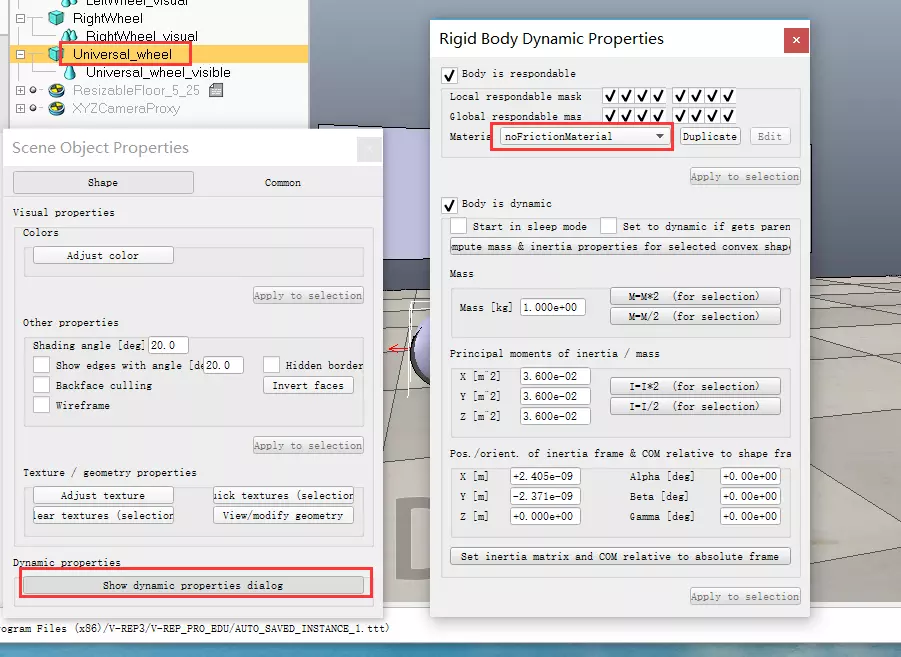

# Vrep

# 0.安装

下载并解压

`http://www.v-rep.eu/files/V-REP_PRO_EDU_V3_6_2_Ubuntu16_04.tar.xz`

在解压所得文件夹内

`./vrep.sh`

运行程序

# 1.初识Vrep

Vrep的界面除了菜单栏之外全是按钮，请随意点……


vrep界面

拖动中间的灰白相接的格子地面floor，最常用三种操作：

1. 按住鼠标左键进行拖动——平移
2. 鼠标滚轮滚动——缩放
3. 鼠标中键——旋转

左边大家会看到各种机械臂，这在Vrep中叫做**Model**，model相当于封装好的一个模块，将model加入到右边的环境里，只需要用鼠标左键按住——拖动至仿真环境中，在弹出的对话框总选择OK，点击开始按钮，就可以看到仿真模型运动起来了，是不是很简单？

仿真环境中有了模型之后请看Scene hierarchy，我喜欢叫它模型树。模型树里会多出一个模型，就是你刚才拖进去的机械臂，点开这个模型左边的加号，展开这个模型，可以看到一个机械臂是怎么组成的，是不是又不那么简单呢？

接下来请注意左上角的Model browser（模型浏览器），选择robots/mobile文件夹，在下面可视化的界面中可以看到很多好玩的模型，随便拖几个进去玩，感受一下动力学仿真的乐趣。

------

玩的差不多了吧，如果你好好玩了的话，你会发现有些模型会受到重力作用掉下去，而有的模型却飘在空中自由自在不受重力影响，记下这个问题，后面有趣的事情会更多。（*记：为什么有的具有重力属性，有的没有？*）

现在请尝试使用暂停、停止按钮，并尝试使用停止按钮右边的乌龟和兔子按钮，如果现象不是很明显的话就一直点直到变灰，是不是发现仿真的速度变慢/快了。

接下来点右边的多窗口按钮（page selector），选择一个合适的视图组合。

# 2.Vrep小车建模——前进和转向

## Step1模型准备

说明：这个模型可以从零开始建立，也可以根据我给大家提供的起始文件，起始文件我放在淘宝上了，大家可以购买得到，收费的目的是为了让大家更加珍视这次Vrep的学习过程，希望大家不要半途而废，也是我坚持完成系列教程的动力所在。[宝贝链接](https://item.taobao.com/item.htm?spm=a1z38n.10677092.0.0.57f05854oSUPrX&id=563797690100)


起始文件


## Step2构建驱动轮

这里搭建的小车为大家熟知的**万向轮小车**，通过小车后面两个轮子的速度匹配实现前进、转向、后退等运动，是最常见的小车运动形式之一。现在我们先构建一个主动驱动轮。
主动驱动轮的构建思路如下：

1. 建立一个扁平状的圆柱体，作为驱动轮的实体
2. 调整驱动轮的位置和方向，满足滚动的要求
3. 设置实体轮子的动力学参数
4. 将实体轮与贴纸轮组合，完成一个驱动轮构建
5. 通过复制操作，完成两个驱动轮的摆放

### 2.1添加实体

向环境中添加一个圆柱体，从菜单栏依次选择`[Menu bar --> Add --> Primitive shape --> Sphere]`，参数按照下图1进行配置，仅需要修改红框中的内容，得到图2中的结果。


图1 添加圆柱体对话框


图2 添加轮子实体后

2.2调整位置和方向

默认添加轮子的方向不符合滚动要求，需要将其竖直起来。首先在模型树选中刚加入的圆柱体Cylinder，点击旋转按钮，根据图3完成操作。


图3 旋转实体轮


调整轮子的位置，将相对于world坐标系的Z方向位置为0.1175（=0.235/2），设置过程见图4.


图4 设置轮子的空间位置

### 2.3设置实体轮子的动力学参数

关闭平移和旋转的对话框，双击模型树中，模型前面的图标，见图5，打开模型属性窗口。按照图6完成模型的质量属性和转动惯量属性修改。完成此项工作之后，可以尝试运行一下仿真，看看实体轮是否会运动。


图5 双击显示模型属性对话框


图6 模型质量属性和转动惯量属性设置

### 2.4与贴纸轮结合，完成一个主动驱动轮的设计

由于添加的实体圆柱轮看起来实在太丑，因此我为大家提供了一个贴纸轮，为什么叫做贴纸轮呢？是因为这个轮子只提供一个外观，并不参与到动力学计算中，就好像我在上面贴了一层图案。贴纸轮的获取方式请点击[宝贝链接](https://item.taobao.com/item.htm?spm=a1z38n.10677092.0.0.57f05854oSUPrX&id=563797690100)。


好看的贴纸轮^-^


将贴纸轮位置设置与实体轮重合，我们这里采用一种更为便捷的方式，也是后面涉及到**Vrep装配最常用的手段之一**，请大家注意。
首先先用鼠标点选贴纸轮，然后摁住Ctrl键，选择实体轮，点击移动按钮，在平移对话框里选择`Apply to selection`，完成移动，具体过程见图7。移动后的效果见图8。

> 这里需要强调一下**点击的顺序，先选择的是希望移动的部分，最后选择的是目标位置**。这里希望将贴纸轮移动到实体轮这里，所以首先点击贴纸轮，然后点击实体轮。


图7 将贴纸轮移动到实体轮的位置


图8 移动后的效果

### 2.5通过复制操作，完成两个驱动轮的摆放

这里我们在学习两个操作，第一个是**复制**操作，第二个是**调整模型树中的层次关系**。
用Ctrl按键同时选择实体轮和贴纸轮，利用快捷键`Ctrl + c`,`Ctrl + v`完成复制粘贴。
选择模型树中的`LeftWheel_visual`，用快捷键`del`将其删除（由于我们刚才已经复制产生了新的贴纸轮，就不需要原来的贴纸轮了）。
现在修改模型树中的模型名称，双击模型树的模型名称进入编辑状态，见下图，将`Cylinder`修改为`RightWheel`，将`Cylinder0`修改为`LeftWheel`，将`RightWheel_visual0`改为`LeftWheel_visual`


编辑模型名称


修改模型名称


现在调整模型树的层次结构，在模型树窗口中，鼠标拖动至上，拖动至上，完成后的效果如下：


模型树调整之后


> Vrep简单易用主要体现在模型树的操作十分灵活，装配非常方便，灵活应用平移旋转工具调整好相对位置之后就可以用模型树固定下相对关系，对于组装复杂的模型非常便捷，大家后面会慢慢体会到。

完成上面的工作之后，将两个轮子按照XOZ平面对称放置，左驱动轮的设置如图9，右轮类似，将Y方向坐标设置为`-0.25`即可。


图9 左驱动轮的设置


最后的样子为下图：


步骤2完成图


## 3添加车身和万向轮

### 3.1添加车身

车身采用一个长方体即可，在`[Menu bar --> Add --> Primitive shape --> Cuboid]`，设置参数如下图：


添加车身


将车身名称改为,点开平移对话框，设置其位置如下图：


更改车身位置


将移动到上，操作参考，完成后效果如下(由于车身贴纸比车身小一点，所以看不到了):


车身贴纸与车身重合


将车身贴纸移动到车身下一层，修改车身动力学属性，如下图。至此已完成车身的构建，可以尝试运行一下仿真，看看效果。


车身动力学属性调整

### 3.2构建万向轮

真实的模拟万向轮相对麻烦一点，这里为了第一个教程的简便，我们采用一种**投机取巧**的办法，我们把万向轮抽象为一个与地面没有摩擦力的实体，即实现了万向轮的功能。

> 这种“投机取巧”的行为在后面的动力学仿真中会经常用到，通过合理的抽象，将一些次要功能简单化的实现，从而将注意力集中到核心问题上，达到自己的研究目的。这是我们用到的第一个投机取巧的功能，后续我会不断介绍一些小技巧，让大家能够更快更好的完成仿真。

**鉴于大家已经认真完成上面的操作走到这里，下面我将不再细致的讲解已经说明的操作。**
通过菜单栏添加一个球体（Sphere），设置球体直径为0.15，修改其名称为`Universal_wheel`，调整其空间位置如下图。将贴纸轮与球体重合，并修改层次关系。最后设置一下球体的动力学属性以，完成万向轮的构建。


万向轮设置


最后别忘了一点，我们需要设置万向轮与地面，选择。




万向轮材料属性设置


完成上述内容后可以尝试运行一下仿真，发现车体迅速分解，下一节我们就添加约束关系。

## 4添加各部件约束，完成车体模型树构建

### 4.1将万向轮与车身固定

在Vrep中有两种方式可以将两个具有动力学属性的物体固定

1. 采用力传感器（Force sensor）将两个物体进行连接，实现固连
2. 采用`Group`或`Merge`将两个物体进行组合

我们这里先采用第一种方式，`[Menu bar --> Add --> Force sensor]`，移动其位置，并按照下图设置模型层次。运行仿真，可以看到万向轮与车身不会分开。


力传感器添加


4.2添加驱动关节
驱动关节可以模拟机器人的驱动电机，能够实现速度控制、位置控制和力控制等。我们这里准备采用速度控制。

采用菜单栏命令`[Menu bar --> Add --> Joint --> Revolute ]`，得到下图。将关节名字重命名为`RightMotor`。


image.png


这里我们还是采用2.4节的位置调整方式，不过这次我们不仅要调整关节的位置，还需要调整关节的方向。调整关节位置依然是首先选择关节，然后选择右轮，然后选择位置选项卡，完成平移。


调整驱动关节位置


旋转操作类似，依次执行下图的操作，完成方向设置。


调整驱动关节方向

重复上面的操作，完成左轮的驱动关节添加，最后调整关节的模型层次树，最后结果见下图。运行仿真，发现车体没有解体，证明我们的车身结构已经搭建完成。


关节添加完成图

> 如果在完成车身结构搭建后，运行仿真发现车身会运动，可以选择不同的求解器，看看不同求解器的差别，下面将解决无缘无故车体运动的问题。
>
> 
>
> 
>
> 尝试不同的求解器试试

## 5完成全部工作

### 5.1设置可见和不可见属性

现在模型和帖子混在一起，既看起来丑，也没有发挥贴纸的作用，下面将简单的实体隐藏。
选择`Car_body`，打开属性对话框，按照下图设置，将其隐藏。


image.png


同理，对于非贴纸类型的，都隐藏，得到下图，是不是好看多了？


调整隐藏关系后


感觉车身位置略高，我们需要重新调整一下贴纸的位置，


修正车身高度

### 5.2设置关节驱动参数

关节需要打开Motor enable，使得关节能够输出扭矩，提供动力，将左右两个关节均按照下图设置，设置完成后尝试运行一下仿真。
关节驱动设置
可以看到模型可以运动，试着给两个电机不同的速度信号，实现转向。

细心的同学可能会发现给关节电机是正方向的指令，但是小车却是向后运动。这个没有关系，只要我们在给电机输入指令是注意一下即可。强迫症的同学请尝试旋转关节，将其正方向与小车前进方向对应，这里不再赘述。

# 3.Vrep小车建模——内嵌脚本

## Step0基础知识

Vrep最强大的功能之一就是能够通过各种脚本来控制，想必大家在学习vrep的时候已经具备一点基本的编程能力，更多的同学可能已经掌握了Matlab或者是python。本来我原计划是想先用matlab控制小车，想来想去还是决定用Vrep自带的lua来控制，因为这种偏底层的驱动控制我觉得用lua实现最好了，复杂的上层控制再交给matlab，这样就不用涉及到同步模式（synchronous operation mode，这种模式仿真速度会大大降低，软件的通信占据了太多的时间）。
大家可能会疑惑怎么又要学一门语言，而且可能都没有听过lua，没关系的，非常简单。而且既然大家要研究机器人仿真，学习一门语言来极大的加速你的学习过程，这个我想是非常值得的。做机器人，大家就要有这个心理准备，机械、电子、编程啥都不会点，还怎么搞机器人，是吧？
废话少说，下面的安排是：

1. 用脚本驱动小车运动
2. 用GUI驱动控制小车运动参数（**重要**）
3. 显示数据曲线

## Step1用脚本控制小车运动

Vrep的脚本类型非常多，最常用的就4种，non-thread child script，threaded child script，joint control callback scripts和customization scripts。各种脚本之间使用非常类似，今天就先讲non-thread child script。
Non-thread child script，从名字上也能看出来，这个脚本是单线程的，不能并行执行。记得有位知友在知乎上曾经说过Vrep有个问题就是脚本执行的顺序是未知的，其实这个问题可以通过两个方式来避免，第一个就是设置不同脚本的优先级，另一个就是一般复杂度的问题并不会遇到，所以大家刚开始时候不要过于担心。
废话说的有点多，只是希望大家不要有惧怕心理，开始吧。
这一节依然使用上一节的做好的小车，第一个功能是我们添加一个脚本，让小车能够按照不同的速度运动。


图1 起始的环境


按照图2添加一个Non-thread child script，将其绑定在Car_body实体上，见图3。**注：添加完child 脚本后不能直接绑定实体，需要先切换到另一个脚本上（如Main script），然后再切换回来，才可以绑定。**


图2 添加脚本


图3 绑定Car_body后在实体后出现脚本的标志


添加脚本后，我们双击Car_body后的脚本图标，打开脚本编辑器：


图4 打开脚本编辑器

到这里我们可以先看一下脚本的大结构:

```lua
function sysCall_init()
    --完成初始化工作
end

function sysCall_actuation()
    --做执行动作，比如控制关节运动，位置移动等
end

function sysCall_sensing()
    -- 执行感知操作，比如读取距离传感器数据，读取关节力矩等
end

function sysCall_cleanup()
    --执行清理工作，比如要清楚掉建立的GUI窗口什么的
end
```

看了这个结构大家就很清楚了嘛，如果有点工程经验就会更清楚了。

- 初始化（Initialization）：初始化这个语句只执行一次，也是在仿真开始的时候执行，主要完成变量初始值的初始化，获取你需要的实体的handle（句柄，或者理解成指向仿真环境中的某个部件的指针，随意理解，接受为主）
- 执行（Actuation）：“执行”相当于在提交到动力学引擎计算之前进行的操作，比如你这里设置了关节的转速，然后动力学引擎就驱动这个关节按照这个转速运动，直到下次再执行到此部分。
- 感知（Sensing）：控制里最重要的一块内容，也是我认为控制系统设计的核心。一切控制算法都是基于反馈来做的，大家做机器人控制一定要注意有些值很难测量或者误差特别大（电机电流，受摩擦影响大），有些值可以精准测量并且误差小（关节角度）。这一部分的执行顺序是位于Actuation之后
- 清理（cleanup）：清理是个好习惯，尤其是后面会给大家介绍使用QT_based GUI的时候，一定要在程序仿真结束后清理。

现在就让我们编写第一个控制小车控制程序吧。将下面的程序覆盖到Car_body脚本中，试一下仿真效果。

```lua
function sysCall_init()
    MotorHandle_Left=simGetObjectHandle('LeftMotor')
    MotorHandle_Right=simGetObjectHandle('RightMotor')
    
    Left_vel = -1
    Right_vel = -3 
end

function sysCall_actuation()
    -- put your actuation code here
    --
    -- For example:
    --
    -- local position=sim.getObjectPosition(handle,-1)
    -- position[1]=position[1]+0.001
    -- sim.setObjectPosition(handle,-1,position)
    simSetJointTargetVelocity(MotorHandle_Left,Left_vel)
    simSetJointTargetVelocity(MotorHandle_Right,Right_vel)
end

function sysCall_sensing()
    -- put your sensing code here
end

function sysCall_cleanup()
    -- do some clean-up here
end
```

添加一个辅助工具，就是`Graph`，使用此工具显示小车运动的轨迹。在Add菜单里选择Graph，打开属性对话框（后面打开属性对话框这些简单操作就不一一截图了），分别添加`Car_body`的x、y、z坐标，修改名字为`Car_body_X`等，操作见图5.

图5 添加Graph


添加完坐标之后，即可添加3D曲线，按照图6的方式添加，可以更改Curve width改变线宽。关闭Graph的属性窗口，运行仿真，得到图7的结果。


图6 添加3D曲线


图7 3D Curve效果


> 3D Curve是非常有用的，比如你要观察机械臂的末端的运动轨迹的时候，就可以利用此方式添加一条轨迹。

采用脚本编程一定要学会**读文档**，按照下面两张图，找到`simSetJointTargetVelocity`这个函数的说明，注意他的输入值和返回值。

http://www.v-rep.eu/helpFiles/index.html


打开vrep的帮助文档


查看函数手册

## Step2利用GUI驱动控制小车运动参数

上面介绍了一种用初始化转速的方式控制小车的运动，如果将你的控制代码嵌入到控制程序中即可使用。但是另一种使用场景为我们希望采用界面操作的方式手动输入一些参数，或者是采用一些滑块等方式调整仿真状态，这就涉及到了采用GUI实现的方式。
Vrep中在3.3.2版本中支持两种GUI的构建，一种是基于OenGl-based custom UIs，另一种是基于Qt-based custom UIs。OpenGl这种方式刚开始使用的时候比较方便，但是灵活性太差，**OpenGl在3.4版本中已经废弃了**。Qt的构建方式虽然入门稍微稍微难一点，但是还是使用一段时间后就会发现非常好用，而且修改起来很方便，所以这里就直接给大家介绍基于Qt的构建方式。
Qt构建方式是基于xml的方式构建的，就是利用一种约定俗成的方式描述各个控件，如果你有做网页等相关的基础，做这个就还是很easy啦。具体的语法我就不一一讲解了，这种标记语言你就接受就可以了，有什么不清楚的地方大家还是自己查一下xml的格式。
将下面的代码复制到Car_body的脚本中，仿真查看仿真效果见图8。

```lua
xml = [[
<ui closeable="true" onclose="closeEventHandler" resizable="true">
    <label text="Car control pan" wordwrap="true" />
    <group>
        <label text="Right wheel speed:"  wordwrap="true" />
        <spinbox minimum="-30" maximum="30" onchange = "Right_speed_set" />
        <label text="Left wheel speed:0" wordwrap="true" />
        <spinbox minimum="-30" maximum="30" onchange = "Left_speed_set" />
        <stretch />
    </group>
    
    <group>
        <button text="Start move" onclick = "Start_move" />
        <button text="Stop move" onclick = "Stop_move" />
        <stretch />
    </group>
    
</ui>
]]

function Start_move(h)
    Start_flag = true
    
end
function Stop_move(h)
    Start_flag = false
    
end
function Right_speed_set(ui,id,newVal)
    Right_vel = newVal
end
function Left_speed_set(ui,id,newVal)
    Left_vel = newVal
end

function closeEventHandler(h)
    simAddStatusbarMessage('Window '..h..' is closing...')
    simExtCustomUI_hide(h)
end

function sysCall_init()
    MotorHandle_Left=simGetObjectHandle('LeftMotor')
    MotorHandle_Right=simGetObjectHandle('RightMotor')
    
    ui=simExtCustomUI_create(xml)
    Left_vel = 0
    Right_vel = 0 
    Start_flag = false
end

function sysCall_actuation()
    if Start_flag then
        simSetJointTargetVelocity(MotorHandle_Left,Left_vel)
        simSetJointTargetVelocity(MotorHandle_Right,Right_vel)
    else
        simSetJointTargetVelocity(MotorHandle_Left,0)
        simSetJointTargetVelocity(MotorHandle_Right,0)
    end
end

function sysCall_sensing()
    -- put your sensing code here
end

function sysCall_cleanup()
    simExtCustomUI_destroy(ui)
end
```


图8 简版小车控制GUI

**除此之外我还提供了一个功能比较完备的控制台，具备参数更新等功能，也增加了一些控件支持，足够大部分功能的应用需求，后续仅需要修改部分代码就可以移植，购买请点击本节教程链接。**（由于Vrep中不支持中文，因此代码中文注释版也放在教程链接中了，上面给出的代码为可执行代码，并没有注释）

## Step3显示数据曲线

在实际仿真过程中，我们往往需要查看一些运动数据，采用图表的形式展示出来。刚才我们采用Graph，用于绘制车体运动的轨迹曲线，接下来，我们同样采用Graph，用于绘制运动过程中驱动关节的实际速度。
使用菜单栏Add添加Graph，按照图9的方式分别添加两轮的速度数据流(Data stream)，修改数据流的名称为`Left_speed`和`Right_speed`，如图10所示。


图9 添加关节运动速度的数据流


图10

关闭Graph属性窗口，我们这里建立一个窗口用于显示曲线。我们采用floating view的手段（在3.4版本中会自动建立一个图表窗口，3.3版本没有）。在仿真的page任意点击鼠标右键，按照图11的方式添加，一个空白的floating view窗口。


图11 添加floating View

添加一个空白的窗口后需要将此窗口和刚才添加的Graph0进行链接，按照图12进行操作（注意第二部为在floating view处右击）。链接好了之后可以进行仿真，就可以看到图线了。（由于默认的曲线颜色均是红色，不便于区分，可以在Graph中进行设置，可以在图13中设置曲线颜色）


图12 链接Graph0和floating view窗口


图13设置曲线颜色

## 结语

采用lua实现一些功能绝对是你之后进行机器人仿真的一大利器，我在第二篇的连载教程里就讲完，是因为后面很多功能需要用到，所以希望大家一定要将本文的例程研究透彻，当然最好购买完整的[代码](https://item.taobao.com/item.htm?spm=a1z38n.10677092.0.0.5c83ab30OWqu23&id=564107062247)，尽快的掌握Vrep的使用。

# 4.Vrep小车建模——matlab控制

# 本节介绍

前面的废话比较多，现在正式介绍本节的内容。vrep已经提供了和matlab的接口，通过Remote API进行连接，通过含有`Get`的函数从Vrep端读取数据，通过含有`Set`的函数将matlab的数据传输到vrep。数据可以是vrep中提供的一些类型数据，比如Postion，Velocity等等这些；当然也可以设置一些用户自定义的数据，比如你要通过matlab调节pid，可以通过matlab打包（pack）这些数据，然后在vrep中进行解包（unpack）。这一节仍然是基于vrep小车，完成以下几方面内容：

1. matlab控制小车运动和停止；
2. matlab控制小车运动到某个固定位置；
3. 添加视觉传感器，并将传感器图像传输到matlab中；
   **完整例程模型请点击购买**

# Step1 准备工作

matlab和vrep连接需要一些基本文件。首先要注意你的系统是**32位**的还是**64位**的，还有你安装的vrep的版本。
如果你安装的是**3.4.0版本**，那么你的vrep是装在`C:\Program Files\V-REP3`这个目录下，如果你的是**3.3.2版本**，那么你的vrep是装在`C:\Program Files (x86)\V-REP3`这个目录下，下面以3.3.2版本为例，如果你用3.4版本的话就直接替换前面的路径即可。
先新建一个matlab的工作路径，比如我这里建立一个`E:\monkey\Vrep Tutorial\3vrep_car_Matlab`的路径。打开`C:\Program Files (x86)\V-REP3\V-REP_PRO_EDU\programming\remoteApiBindings\lib\lib`，根据你的系统选择合适的文件夹，将下面的`remoteApi.dll`文件拷贝到你的matlab工作路径中；然后打开`C:\Program Files (x86)\V-REP3\V-REP_PRO_EDU\programming\remoteApiBindings\matlab\matlab`,将此文件夹下的所有文件都拷贝到你的工作路径下。看文字太麻烦的请看下面的动图，是不是要高喊666！！（感谢GifCam这款软件，太棒了！）


拷贝所需要的文件


# Step1 Matlab控制小车运动和停止

前两节教程我们制作了一个双轮驱动的小车，有同学和我反应说是万向轮有点丑，用球体来抽象实在是太难看了，并且修改了一些小bug（比如轮子速度与直观感觉相反），这里我修改了一下，看下图。是不是看起来自然了一点？


万向轮修改后


万向轮处理完了之后，我们在车轮中间添加一个标志点，名称为dummy。这个dummy的功能非常多，可以单独使用，也可以成对使用，下面就简单列举几种功能：

- 单独使用

1. 用于做坐标系转换的中间参考，比如机械臂的安装位置和小车的转动中心有一定的偏差，可以中间加一个参考坐标dummy
2. 做一些显示，比如显示机械臂末端的位置
3. 做为一些非dynamic的的父节点。比如环境中的floor的父节点就是dummy。

- 成对使用

1. 用于逆运动学解算，IK
2. 动力学约束。比如你要让连杆结构的两个点始终固连到一起（这种情况一般常见于**闭运动链**）
3. 当你搞不清坐标转换关系时，用一堆dummy去求相对位置和角度

大家刚开始用，要慢慢体会dummy的妙处，我这里先抛砖引玉。这里我们要在两个车轮的中心位置添加一个dummy，作为车辆的回转中心，同时添加一个目标位置，一会我们通过移动目标位置（黄色区域），控制小车能够准确驶入目标区域。我们使用这个状态作为起始状态，文件名为`Vrep3_car_code_Step1.ttt`，获取文件请[点击购买](https://item.taobao.com/item.htm?spm=0.7095261.0.0.2eb4cc2dOQp9u5&id=564553923700)。

